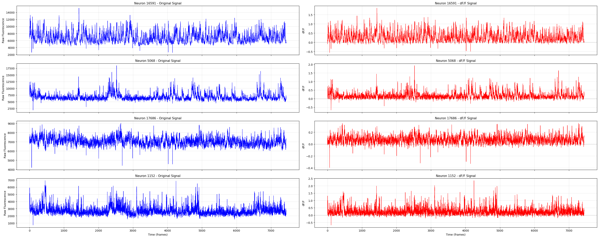
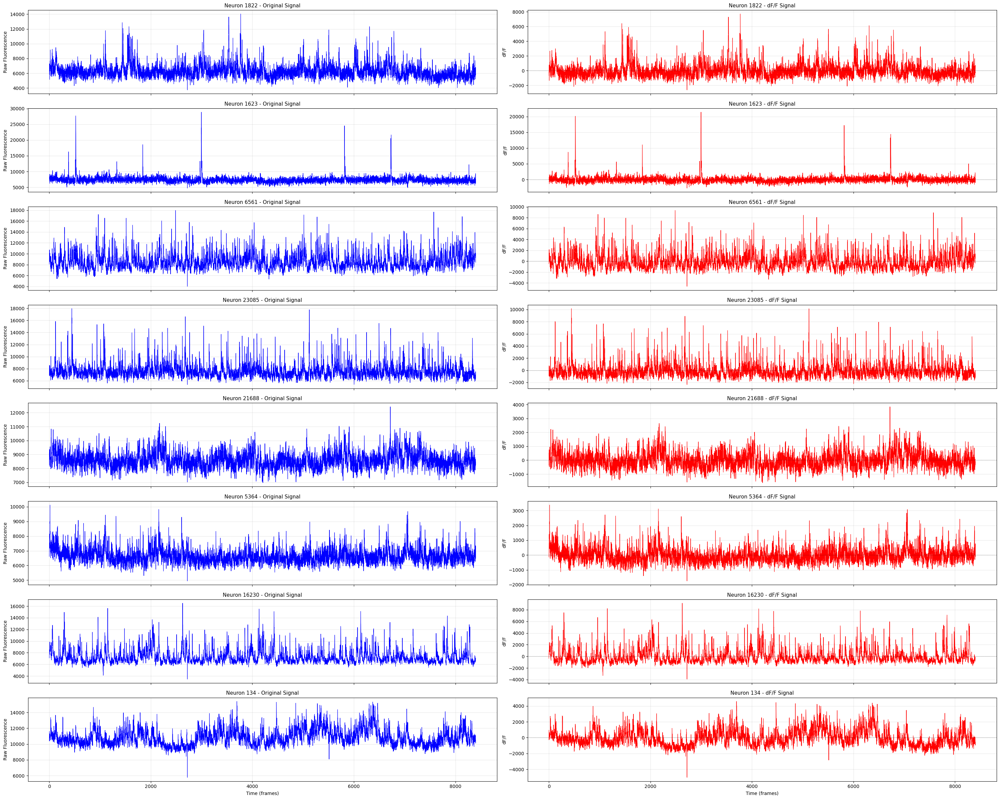

---
title: "df/F 矫正"
tags:
  - research-log
  - calcium-imaging
  - data-preprocessing
---

2025年12月2日 @Yun

---

## 公式与物理意义

### 公式

$$
\frac{\Delta F}{F}(t) = \frac{F(t) - F_0(t)}{F_0(t)}
$$

- $F(t): t$ 时刻测量到的原始荧光强度。
- $F_0(t): t$ 时刻该神经元的**基线荧光强度（Baseline Fluorescence）**。

### 物理意义

钙成像的原始荧光强度（Raw Fluorescence）是一个没有量纲的相对值（Arbitrary Units, A.U.），它受到多种非生物因素的影响：

1. **染料表达量：** 某个神经元表达了更多的 GCaMP 蛋白，它就更亮。
2. **激发光强度：** 视野（FOV）中心的激光比边缘强。
3. **组织深度：** 深层的神经元信号会被散射得更弱。

$\Delta F/F$ 的作用是归一化（Normalization）：

它计算的是相对于基线的变化百分比。这使得你可以：

- 比较同一个视野中**暗神经元**和**亮神经元**的活跃程度。
- 比较实验开始时（荧光强）和实验结束时（荧光因漂白变弱）的信号。

---

## $F_0$ (基线) 的计算算法

$\Delta F/F$ 的质量完全取决于 $F_0$ 算得准不准。最简单的方法是用全段平均值，但这在神经科学中是**错误**的，因为平均值会受到神经元发放（Spikes）的污染。

目前公认最稳健的算法是**“滑动窗口百分位数法” (Sliding Window Percentile)**。

### 算法步骤：

1. **定义时间窗口：** 选择一个滑动窗口（例如 30秒 或 60秒）。
   - _对于你的 4Hz 数据，60秒意味着 240 个点。_
2. **计算百分位数：** 在每个时刻 ，取 $[t - W/2, t + W/2]$ 区间内的所有数据点，计算其 **10% ~ 20% 分位数（Percentile）**。
   - _为什么不是最小值？_ 最小值对噪声太敏感。
   - _为什么不是中位数？_ 如果神经元发放频率很高，中位数可能代表活跃状态而非静息状态。10-20% 通常被认为是鲁棒的“静息水平”。
3. **平滑处理：** 得到的 $F_0(t)$ 曲线可能呈阶梯状，通常再进行一次高斯平滑。

---

荧光信号的物理特性决定了**噪声和漂移通常是乘性的（Multiplicative），而不是加性的**。

用百分位 8作为基线，窗口大小设为150帧（约40s），做df / F矫正

```python
from scipy import ndimage

win_size = 151
T, N = neuron_data.shape
F0_dynamic = np.zeros((T, N), dtype=float)
for i in range(N):
    # ndimage.percentile_filter 输出每帧的窗口百分位值
    F0_dynamic[:, i] = ndimage.percentile_filter(neuron_data[:, i], percentile=8, size=win_size, mode='reflect')
deltaF_over_F0 = (neuron_data - F0_dynamic) / F0_dynamic
```



效果要好于直接调用detrend函数 or 高通滤波（仅考虑信号形状）


