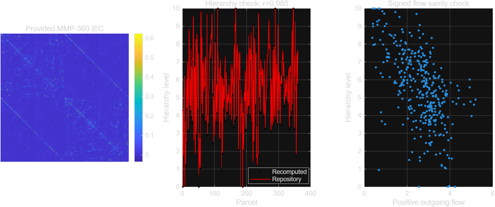

# State-dependent signal flow hierarchy in the human cerebral cortex

## 文献身份

- **正式引用**：Oh, Y., Ann, Y., Lee, J.-J., Ito, T., Froudist-Walsh, S., Paquola, C., Milham, M., Spreng, R. N., Margulies, D., Bernhardt, B., Woo, C.-W., & Hong, S.-J. (2026). _State-dependent signal flow hierarchy in the human cerebral cortex_. **Nature Neuroscience**.
- **DOI**：[10.1038/s41593-026-02389-8](https://doi.org/10.1038/s41593-026-02389-8)
- **正式版**：[Nature Neuroscience article](https://www.nature.com/articles/s41593-026-02389-8)
- **预印本**：早期版本题为 _In vivo cartography of state-dependent signal flow hierarchy in the human cerebral cortex_，可见 [PMC 版本](https://pmc.ncbi.nlm.nih.gov/articles/PMC12262477/)。正式版的算法配置和部分分析已有更新，应以正式版代码和补充材料为准。
- **代码**：[COMBINE-SKKU/SignalFlow_Hierarchy](https://github.com/COMBINE-SKKU/SignalFlow_Hierarchy)

## 一句话摘要

作者提出 integrated effective connectivity（iEC）框架，把多种有向有效连接算法集成起来，并从人类 fMRI 中重建一个具有解剖学依据的“感觉运动—联合—旁边缘”信号流层级。该层级在不同脑状态下保留总体骨架，但会发生状态依赖性重组：观看电影时层级变平，持续疼痛时旁边缘区与其他皮层的层级差距增大、层级变陡。

## 研究问题

1. 多种 EC 算法能否通过集成提高宏观有向连接估计的稳定性？
2. 能否只用人类 fMRI 的有向连接估计皮层层级，而不依赖人类脑的直接解剖示踪 ground truth？
3. 皮层层级是固定的结构骨架，还是会随外部/内部状态改变？

## 核心方法

### 1. 多算法 iEC

正式版代码列出的候选算法包括：rDCM、VAR、FASK、CCD、BOSS、directLiNGAM、GRASP 和 Patel's Tau；猕猴分析包含 9 种算法，人类分析包含 8 种算法，MVGC 因对 HRF 变异较敏感而排除。不同算法的输出通过贝叶斯优化得到权重，再构造集成矩阵。

### 2. 三层验证

| 层级 | 数据/模型                                                           | 目的                                     |
| ---- | ------------------------------------------------------------------- | ---------------------------------------- |
| 模拟 | 以 HCP 扩散 MRI 结构连接为模板生成有向网络，再用 Hopf 模型模拟 BOLD | 与已知有向网络比较                       |
| 猕猴 | 19 只麻醉猕猴的静息态 fMRI，与示踪实验的 FLN/SLN 比较               | 生物学方向性验证                         |
| 人类 | HCP 静息态 fMRI，通过 EC → Hopf → FC recovery 间接评价              | 人类缺少方向性 ground truth 时的模型检验 |

HCP 静息态数据按 220/220 划分训练和测试集。正式版补充材料显示，HCP 训练集和测试集得到的层级图空间相关为 **r = 0.96**。模拟测试中，完整 iEC 在 Schaefer-100 和 MMP-360 下优于最佳单一算法，测试集相关中位数约为 **0.75** 和 **0.65**。见 [正式版补充材料](https://media.springernature.com/original/springer-static/esm/art%3A10.1038%2Fs41593-026-02389-8/MediaObjects/41593_2026_2389_MOESM1_ESM.pdf)。

### 3. 层级估计

作者将脑区之间的 EC 近似写成层级差：

\[
E(EC\_{ij}) \approx \beta_i - \beta_j
\]

其中 \(\beta_i\) 是脑区的层级值。实际计算中保留绝对权重最大的前 15% 连接，用最小二乘法得到全脑的相对层级。该方法得到的是使整体有向连接关系“张力最小”的全局折中解，不是每条连接都严格满足的唯一解。

## 主要结果

### 1. 正负有向信号具有层级差异

- 初级感觉/运动区输出以正向连接为主；
- 异模态联合区的正负输出更平衡；
- 负向信号主要从高阶区域指向低阶区域；
- 负向连接单条强度较弱，但对高阶和旁边缘区域的层级估计很重要。

作者将其与前馈（FF）和反馈（FB）通路联系起来：前馈更偏驱动性，反馈包含更强的调制性和负向成分。但这只是宏观 fMRI 层面的生物学解释，不能直接等同于单突触兴奋/抑制。

### 2. 皮层层级是感觉运动—联合—旁边缘轴

层级从初级感觉和运动皮层逐渐升高，经单模态/异模态联合皮层，最后到前扣带、岛叶、海马旁回等旁边缘区域。iEC 层级与传统无向功能梯度相关但不相同；预印本报告与功能梯度的空间相关为 **r = 0.34**，与髓鞘程度的相关约为 **r = 0.42**。补充材料给出髓鞘相关 \(P = 1.18 \times 10^{-14}\)。

该层级还符合结构模型的预测：颗粒层较丰富的 koniocortex/eulaminate 皮层偏低层级，而 dysgranular/agranular 皮层，尤其旁边缘区，偏高层级。

### 3. 电影观看：层级变平

观看《阿甘正传》时，初级感觉和单模态联合区域层级相对升高，而异模态联合和旁边缘区域相对降低；全脑层级差异减小。信号流分析显示感觉区正向输出下降、旁边缘负向输出下降，同时高阶视觉区对听觉区的负向调制增加。作者将其解释为外部感觉输入、多感官整合和注意资源竞争导致的层级扁平化。

### 4. 持续疼痛：层级变陡

舌部辣椒素诱发的持续疼痛状态下，旁边缘区的高层级特征更突出，异模态联合区（尤其角回）的负向输出减少，旁边缘系统成为更明显的负向/自上而下调制来源。作者认为，这可能反映了持续内部身体威胁下对内感受、稳态和异稳态控制的优先化。

## 对 TVB/全脑模型的意义

TVB 通常把结构连接作为长程耦合骨架，把纤维长度转化为传导延迟。[TVB 官方教程](https://docs.thevirtualbrain.org/tutorials/tutorial_1_BuildingYourOwnBrainNetworkModel.html)。iEC 更适合作为“宏观有效耦合层”，而不是直接替代结构连接：

\[
\dot{x}_i = f_i(x_i) + \sum_j W^{\mathrm{effective}}_{ij}(s)H\!\left(x*j\!\left(t-\tau^{\mathrm{struct}}*{ij}\right)\right)
\]

建议保留 DWI-SC 和 tract length 负责拓扑/延迟，用 iEC 负责方向、正负增益和状态依赖。一个更具生理可解释性的实现是拆分：

\[
W^+ = \max(W,0), \qquad W^- = \max(-W,0)
\]

分别把正向驱动和负向调制映射到神经质量模型中的兴奋性与抑制性/调制性通道。电影、疼痛和静息 iEC 可以作为不同状态的耦合矩阵，或者进一步用滑动窗口估计连续的状态依赖耦合。

可比较的模型层级包括：

1. SC-only TVB；
2. SC + 静态 iEC；
3. SC + 状态特异性 iEC；
4. SC + 正负分离 iEC；
5. SC + iEC + 个体化局部 E-I 参数。

验证指标不应只包括静态 FC，还应包括 FCD、功率谱、metastability、BOLD lag、EEG/MEG 频谱、状态转换和扰动响应。

## 批判性评价

### 优势

- 多算法集成，降低单一 EC 算法假设的影响；
- 模拟、猕猴示踪和人类数据三层验证；
- 训练/测试拆分和多阈值稳健性分析；
- 与细胞构筑、髓鞘和层板结构模型存在跨模态收敛；
- 代码和处理后的衍生数据公开，便于进一步接入 TVB。

### 主要限制

1. fMRI EC 仍然是宏观统计方向性，不等于神经元或突触层面的因果连接。
2. 人类验证依赖 EC → Hopf → FC recovery，存在模型依赖，不能视为真实方向性的直接 ground truth。
3. 模拟有向网络通过随机重连产生，方向性并非真实皮层层板方向。
4. 静息、电影和疼痛数据来自不同队列、扫描仪和预处理流程；预印本报告电影数据仅 13 人，疼痛数据 48 人，因此状态效应可能混入数据集差异。
5. 旁边缘区与内感受/异稳态控制的联系具有理论合理性，但本研究没有同时测量自主神经、内感受或下丘脑/脑干机制。
6. 皮层层级是全局最小张力的相对排序；不能解释为固定的绝对层级编号。
7. 深部结构因信噪比较低而未纳入，当前结果严格说是“皮层层级”，不是完整全脑层级。

## 最小复现测试

本地从作者仓库下载了代码，并用内置的 MMP-360 静息态 iEC 做了不依赖原始 HCP 数据的最小测试：

- 脚本：[demo_small.m](code/signalflow_demo_small.m)
- 结果：[demo_results.mat](code/outputs/signalflow_demo_results.mat)
- 汇总图：[demo_summary.png](attachments/signalflow_hierarchy_demo.png)
- 运行命令：

```matlab
run('code/signalflow_demo_small.m')
```

结果：重新计算出的层级与仓库内作者保存的参考层级相关 **r = 0.985237**，RMSE = **0.345922**。这说明作者公开的层级计算函数和随仓库提供的 MMP-360 iEC 数据在本机可以正常运行，并且能够重现其核心层级图；它不是独立的生物学验证，因为输入矩阵和参考结果都来自作者仓库。



## 与上一篇 Ubaghs 2026 的并读

上一篇 [Ubaghs 等的同时单细胞钙成像与全脑 BOLD 研究](./同时单细胞钙成像与全脑%20BOLD%20fMRI：Ubaghs%20等（2026）.md) 解决的是**局部观测层**问题：单细胞活动如何经过血管环境转换为 BOLD，以及为什么神经元到血管的距离会造成 BOLD 映射的空间异质性。本文解决的是**全脑通信层**问题：不同皮层区域之间的有向信号如何形成层级，以及层级如何随外部/内部状态重组。

| 维度             | Ubaghs et al. 2026                                  | Oh et al. 2026                                        |
| ---------------- | --------------------------------------------------- | ----------------------------------------------------- |
| 主要尺度         | 清醒小鼠，细胞—血管—局部/全脑 BOLD                  | 人类皮层，脑区—全脑有向信号流                         |
| 核心问题         | 神经活动如何被神经血管耦合“观测”为 BOLD             | 有向有效连接如何组织成皮层层级                        |
| 关键方法         | 同步 Ca 成像、血管剖面和 7T BOLD；解码/局部观测模型 | 多算法 iEC、猕猴 FLN/SLN 验证、Hopf 模型和层级 GLM    |
| 对全脑模型的作用 | 校准每个节点的神经→血管→BOLD 观测层                 | 约束节点之间的方向、符号和状态依赖长程耦合            |
| 主要风险         | 小样本、运动混淆、细胞—血管配准和事件时间问题       | fMRI 方向性、跨数据集状态混淆、人类 ground truth 缺失 |

两篇论文拼起来后，最自然的模型不是“把 iEC 当作新的 SC”，而是一个两层模型：

1. **通信层**：用结构连接提供拓扑/纤维长度，用 iEC 提供状态依赖的有向正负耦合；
2. **观测层**：用 Ubaghs 所提示的细胞—血管异质性校准每个节点的神经血管耦合和 BOLD 生成。

这一区分很重要：如果不同脑区的神经血管耦合不同，那么即使真实神经通信没有改变，BOLD 层面的 EC 也可能出现方向或符号偏差。换句话说，Ubaghs 的结果提供了一个必须在 Oh 的 iEC 解释中控制的“测量模型混淆源”。

## 可以做的研究

### 方向一：结构连接 + iEC 的 TVB 双层模型

以 DWI-SC 和 tract length 保留空间拓扑和传导延迟，以静息/电影/疼痛 iEC 作为状态依赖的长程增益。首先比较 SC-only、SC+iEC 和 SC+state-iEC 三个模型，评价 FC、FCD、功率谱、BOLD lag 和层级斜率的 out-of-sample 拟合。

### 方向二：把 Ubaghs 的神经血管耦合放入 TVB 观测层

为不同节点设置不同的神经→血管耦合参数或 HRF，区分近血管和远血管神经群体。这样可以测试：在引入真实的局部 NVC 异质性后，Oh 论文中观察到的负向反馈和旁边缘高层级是否仍然存在。

### 方向三：最有价值的反事实测试

用一个**没有真实负向神经连接**、但包含区域性 HRF/NVC 差异的模型生成 BOLD，再运行 iEC。若模型仍产生类似的负向高阶→低阶信号流，说明其中一部分“反馈抑制”可能是血流动力学产生的表观方向性；若没有，则增强 iEC 生物学解释的可信度。这是连接两篇论文最关键的可证伪实验。

### 方向四：从离散状态走向连续状态

当前论文比较的是静息、电影和持续疼痛三个离散数据集。可以在同一被试中用滑动窗口 iEC 或状态空间模型估计连续的 \(W\_{ij}(s_t)\)，再把内感受、运动、唤醒度或自主神经信号作为状态变量，检验层级斜率是否随状态连续变化。

### 方向五：疾病机制模型

在慢性疼痛、抑郁、自闭症或精神分裂症中，同时改变两类参数：一类是 iEC 的长程方向/符号结构，另一类是局部 NVC 和 HRF。这样可以区分“神经通信异常”和“神经血管观测异常”，避免把 BOLD 低反应直接解释成神经活动低反应。

## 优先级判断

如果只做一个小项目，我建议先做**方向三**：在 TVB/Hopf 中构造结构连接固定、局部 HRF/NVC 异质、但神经耦合不变的仿真，然后运行简化版 iEC。它计算量小、问题清晰，而且能直接检验这两篇论文之间最关键的因果链：

> 局部神经血管耦合异质性，是否会伪造全脑有向层级？

如果这个 sanity check 通过，再把 Oh 的状态特异性 iEC 和 Ubaghs 的局部观测模型整合进完整 TVB，会比直接拟合真实数据更稳妥。

## 我的结论

这篇论文最重要的贡献不是单独提出一个“更好的因果算法”，而是把全脑建模中的长程连接从静态、无向、单层结构，推进到**有向、有符号、可随状态重组的宏观有效通信网络**。对 TVB 而言，最合理的下一步是保留结构连接的空间和时间约束，用 iEC 调节状态依赖的长程增益，再通过 BOLD、FCD、频谱和扰动反应进行外部验证。

当前最稳妥的科学表述是：iEC 是一个具有解剖学一致性的宏观有效耦合先验，而不是已经被证明的突触级因果连接组。
