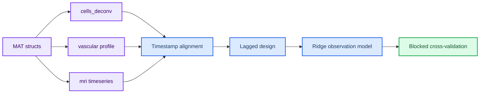

# Ubaghs 2026：局部 CFU 模型探索

_基于公开 MAT 文件，对单细胞 Ca、局部血管信号和 BOLD 之间的局部观测关系进行探索性建模。_

---

这篇记录对应论文阅读笔记中的建模延伸：[同时单细胞钙成像与全脑 BOLD fMRI：Ubaghs 等（2026）](./同时单细胞钙成像与全脑%20BOLD%20fMRI：Ubaghs%20等（2026）.md)。目标不是重复论文已经完成的 SVM 解码，而是检验一个简化的局部 CFU（cortical functional unit）观测模型能否在公开数据上得到基本支持。

## 📋 建模问题

论文最有启发性的结果是，局部神经元与 BOLD 的关系具有空间异质性：带负向 decoder weight 的细胞在刺激时活动下降，并且更靠近血管；带正向权重的细胞活动增强，但距离血管的分布没有明显偏移。[^1] 这提示局部 BOLD 不一定是神经元活动的简单平均，而可能由神经群体状态、血管邻近环境和血管动力学共同决定。

因此，当前分析只问一个弱而明确的问题：**在保持 MRI 原始时间分辨率的前提下，局部 Ca 和血管变量能否在运动基线之外稳定预测局部 BOLD？** 这一步不试图识别 E/I、VIP、SOM、NO 或星形胶质细胞通路，也不把统计相关解释为因果关系。

## ⚙️ 模型与数据处理

公开 MAT 文件以 `data_out.<session>` 的 MATLAB struct 组织。模型使用 `microscopy.mat` 中的 `cells_deconv`，将细胞平均为一个局部 Ca 群体信号；使用 `vasculature.mat` 中的 `vascular` 横截面剖面，并计算每个时间点的半高宽作为血管动态的透明 proxy；使用 `mri.mat` 中 ROI 平均 `timeseries` 作为局部 BOLD，并按论文定义转换为相对变化。

Ca 和血管信号通过 `timestamps_corrected` 映射到 MRI 的 `timestamps`。BOLD 保持原始 1.5 s TR，不采用论文解码中用于数组匹配的 100 ms 插值。对于显微镜激光关闭形成的长时间间断，模型不跨越间断插值；运动参数作为协变量进入模型。

局部模型的形式为：

\[
\hat y*t = \beta_0 + \sum*{\ell=0}^{L} h^{\mathrm{Ca}}_\ell c_{t-\ell} + \sum*{\ell=0}^{L} h^{\mathrm{vessel}}*\ell v\_{t-\ell} + \beta_m m_t,
\]

其中 \(c*t\) 是去卷积 Ca 群体活动，\(v_t\) 是血管宽度 proxy，\(m_t\) 是运动协变量，\(h*\ell\) 是待估计的滞后响应核。这里的滞后核是对 Balloon–Windkessel 观测层的低维近似，而不是完整的生理机制模型。

代码位于 [`ubaghs_local_cfu.py`](code/ubaghs_local_cfu.py)。代码按照 MATLAB/MAT 数据结构读取三个文件，并将结果输出到 [`results.csv`](code/outputs/results.csv) 和 [`local_cfu_model.png`](code/outputs/local_cfu_model.png)。

## 📊 初步结果

分析对公开数据中的 9 个共同 session 进行最低限度拟合。需要注意，其中包含细胞数量较少、并非论文神经分析主样本的 session，因此结果仅作为方法诊断，不应与论文报告的 5 只高质量神经数据动物直接等同。特别加入了两个替代基线：只用运动参数的模型，以及同时循环平移 Ca/血管特征的时间错位模型。

| 模型             | 中位 held-out Pearson \(r\) | 备注                          |
| ---------------- | --------------------------: | ----------------------------- |
| Ca-only          |                        0.17 | 去卷积 Ca 滞后项              |
| 血管-only        |                        0.02 | 半高宽 proxy                  |
| 运动-only        |                        0.36 | 六维 MRI 运动参数的平均 trace |
| Ca + 血管        |                        0.29 | 不含运动参数                  |
| Ca + 血管 + 运动 |                        0.29 | 完整探索模型                  |
| 循环平移 null    |                        0.14 | 保留边际分布和部分自相关      |

_图：灰线为最佳 session 的 ROI ΔBOLD，红线为连续时间块交叉验证的局部模型预测；下方同时显示 Ca-only、运动-only 和完整模型的 held-out 相关。_

完整模型的相关系数在 9 个 session 中有 5 个高于 Ca-only，但只有 1 个 session 高于运动-only；NRMSE 只有 3 个 session 改善。最佳单个 session 的完整模型 \(r\) 约为 0.66，但同一 session 的运动-only \(r\) 约为 0.77，循环平移 null 也达到约 0.53。

结果显示，加入血管 proxy 后，部分 session 的预测相关提高，但整体效果不稳定；更关键的是，运动-only 基线的中位相关高于完整模型。这意味着当前公开数据中能被模型预测的 BOLD 变化，可能很大程度上来自清醒动物的运动及其与神经活动、血管变化的共同时间结构，而不能直接归因于局部 Ca→BOLD 耦合。循环平移 null 仍有非零预测力，也说明样本中的低频结构和有限时间段会抬高预测分数。

因此，对“数据支持怎样的 CFU”作独立判断，当前证据最强的不是一个具体的 Ca→BOLD 生理方程，而是以下较弱的命题：局部 BOLD 的观测层需要显式考虑运动、血管状态和时间滞后；单一平均神经活动变量不足以保证稳健解释。至于血管邻近性是否真的需要独立的神经血管耦合核，现有公开数据尚未给出稳定答案。

## 🔍 对 CFU 建模的启示

这个结果支持将 CFU 的观测层拆成三个问题。第一，局部神经状态如何随时间变化；第二，运动和生理状态如何影响观测；第三，神经状态如何经过血管环境转换成 BOLD。第一部分可以使用 neural mass、低维状态空间模型或经验 latent state；后两部分至少需要允许运动协变量、延迟、增益和血管环境依赖，而不是对所有局部单元使用同一个固定 HRF。

经典 Balloon 模型提供了血流、血容量、脱氧血红蛋白到 BOLD 的动力学框架，但其神经活动到血管的耦合通常是简化的。[^2][^3] Rosa 等通过 Bayesian model comparison 比较了突触驱动、放电驱动和混合驱动的神经血管耦合假设，说明这个耦合层本身可以被作为模型选择问题。[^4] Sten 等进一步把 pyramidal、NO 和 NPY 通路、Windkessel 血管模型与 BOLD 连接起来，为更机制化的 NVC 模型提供了范例。[^5]

针对当前数据，最自然的下一步不是直接拟合完整 Wilson–Cowan，而是比较两个低维模型：

1. **单通道模型**：平均 Ca 活动经过一个共享的 Ca→BOLD 响应核；
2. **双通道模型**：近血管和远血管 Ca 群体分别经过不同响应核，并允许局部血管信号直接贡献 BOLD。

下一步应先取得准确事件时间、保留六维运动参数、分离生理噪声，并将 Ca/血管特征与运动基线进行嵌套比较。之后再比较两个状态空间模型：一个使用单一 Ca 驱动 Balloon–Windkessel，另一个使用近血管/远血管双通道驱动。两者应采用留一 trial、留一 animal 和保留自相关的 circular-shift null 进行比较。如果双通道模型能够在运动控制后跨动物稳定泛化，才有理由将“血管邻近性”写入全脑 CFU 模型的局部参数；如果不能，则应把论文中的空间效应保留为待验证假说。

## ⚠️ 限制与解释边界

第一，当前公开文件没有显式刺激事件向量，Ca 与 MRI 只有各自的时间戳；激光关闭区间可以帮助识别有效采样，但不能替代实验事件日志。第二，公开的 `vascular` 是血管剖面数据，半高宽只是便于复现的 proxy，不等同于论文完整的血管直径提取流程。第三，MRI 结构图只支持显微镜与 SSp-bfd 的区域级对齐，不能支持单细胞到具体 BOLD voxel 的精确配准。[^1]

此外，Ca 信号是 GCaMP6f 的低通代理，去卷积并不等于恢复真实 spike；当前数据也没有同步的抑制性神经元、星形胶质细胞、CBF、CBV 或 CMRO₂。因此，模型参数应理解为预测性和现象学参数，而不是细胞类型特异性的生理常数。Drew 的综述也强调，感觉刺激下的神经—血管关系可以近似为线性卷积，但在不同脑区或行为状态下可能变弱甚至反转。[^6]

## 🔗 相关记录与资料

- [论文阅读笔记](./同时单细胞钙成像与全脑%20BOLD%20fMRI：Ubaghs%20等（2026）.md)
- [局部模型代码](code/ubaghs_local_cfu.py)
- [逐 session 结果](code/outputs/results.csv)
- [模型图](code/outputs/local_cfu_model.png)
- [Figshare source data](https://doi.org/10.6084/m9.figshare.31389115.v2)
- [论文分析代码 camri](https://github.com/rlemubaghs/camri)

## References

[^1]: Ubaghs, R. L. E. M. et al. (2026). “Simultaneous single-cell calcium imaging of neuronal population activity and brain-wide BOLD fMRI.” _Nature Methods_. https://doi.org/10.1038/s41592-026-03154-2

[^2]: Buxton, R. B., Wong, E. C. & Frank, L. R. (1998). “Dynamics of blood flow and oxygenation changes during brain activation: the balloon model.” _Magnetic Resonance in Medicine_. https://doi.org/10.1002/mrm.1910390602

[^3]: Friston, K. J. et al. (2000). “Nonlinear responses in fMRI: the Balloon model, Volterra kernels, and other hemodynamics.” _NeuroImage_. https://doi.org/10.1006/nimg.2000.0630

[^4]: Rosa, M. J., Kilner, J. & Penny, W. D. (2011). “Bayesian comparison of neurovascular coupling models using EEG-fMRI.” _PLoS Computational Biology_. https://doi.org/10.1371/journal.pcbi.1002070

[^5]: Sten, S. et al. (2023). “A quantitative model for human neurovascular coupling with translated mechanisms from animals.” _PLoS Computational Biology_. https://doi.org/10.1371/journal.pcbi.1010818

[^6]: Drew, P. J. (2019). “Vascular and neural basis of the BOLD signal.” _Current Opinion in Neurobiology_. https://doi.org/10.1016/j.conb.2019.06.004
