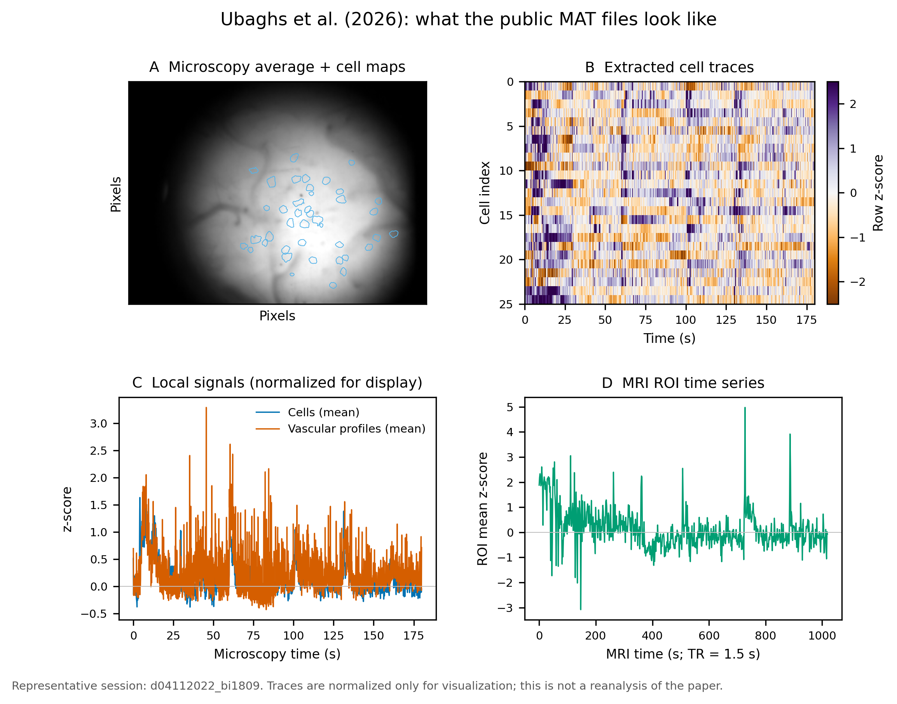

# 同时单细胞钙成像与全脑 BOLD fMRI：Ubaghs 等（2026）

*论文阅读笔记：从单细胞神经活动、局部血管组织到全脑 BOLD 的跨尺度联系。*

> Ubaghs, R. L. E. M., Boehringer, R., Marks, M., Hesse, H. K., Yanik, M. F., Zerbi, V., & Grewe, B. F. (2026). _Simultaneous single-cell calcium imaging of neuronal population activity and brain-wide BOLD fMRI_. Nature Methods, 23, 1637–1646. [DOI: 10.1038/s41592-026-03154-2](https://doi.org/10.1038/s41592-026-03154-2)

## 📋 先说结论

这是一篇把**局部单细胞神经活动**和**全脑血流动力学**放到同一个清醒小鼠、同一个试次中记录的方法学论文。作者最值得强调的发现是：BOLD 并不是所有神经元活动的简单平均，神经元距离血管的远近会影响它与 BOLD 的关系；靠近血管的一部分神经元甚至在刺激时下降，而局部 BOLD 同时上升。[^1]

这篇工作的价值主要在“建立平台”和“改变问题的问法”：过去常问神经活动是否与 BOLD 相关，现在可以进一步问哪些细胞、位于什么血管环境、以什么方向参与 BOLD。机制上，作者提出了血管活性抑制性中间神经元的可能解释，但这部分仍是待验证的假说。[^1]

## 🎯 研究怎么做

实验在小鼠 barrel cortex 上方开 3 mm 颅窗，用 MRI-compatible 单光子显微镜记录 GCaMP6f 标记的 L2/3 锥体神经元，同时在 7 T MRI 中采集全脑 BOLD。显微镜采用外置 488 nm 激光、光纤耦合、屏蔽 CCD、acrylic 物镜和 D₂O 浸没，以避免磁敏感性差异和电磁干扰造成的伪影。光学视野约 1.45 mm²，分辨率约 2.5 μm，钙成像 10 Hz；BOLD 体素约 0.2 × 0.2 × 0.8 mm。[^1]

动物经过至少 10 天的清醒头固定和 MRI 噪声适应，然后对显微镜对侧的胡须垫进行 3 Hz、每次 10 s 的气动刺激，共 12 个 trials。BOLD 分析使用 9 只小鼠，钙成像分析只有 5 只，共提取 236 个细胞；这个样本量是理解结果强度时需要牢记的背景。[^1]

## 📊 结果最重要的三点

第一，系统同时测到了细胞、血管和全脑信号。胡须刺激后，SSp-bfd 中 neuropil ΔF/F 约 2.7%，细胞群 ΔF/F 约 1.7%，血管直径变化约 3.8%，并在多个皮层和皮层下区域诱发显著 BOLD。为减少光热效应，作者在刺激间隔关闭激光，因此钙成像记录会有中断。[^1]

第二，局部钙活动可以预测局部 BOLD。作者用线性 SVM、10 折交叉验证和时间打乱基线检验这一点，真实数据的 NRMSE 显著低于打乱基线（P ≤ 0.005）。这说明两种模态共享信息，但不等于证明某个神经元因果性地驱动了 BOLD。[^1]

第三，也是最值得进一步验证的一点：带负向 decoder weight 的细胞在刺激时活动下降，并且显著更靠近血管（P = 0.0440）；带正向权重的细胞活动增强，但血管距离没有偏移（P = 0.8919）。作者因此提出，血管附近的局部回路可能通过 VIP⁺、SOM⁺ 等血管活性中间神经元改变 BOLD 的方向。这个解释仍属于待验证假说，论文没有直接记录或操控这些细胞。[^1]

作者还做了反向解码：用全脑不同区域的 BOLD 预测局部 SSp-bfd 细胞群活动。运动、感觉、听觉皮层以及纹状体、丘脑等区域都比时间打乱基线更有预测力（P ≤ 0.01），说明局部细胞群状态可以放在分布式全脑网络中理解。[^1]

## 🔍 研究启示与限制

这项工作最重要的观念变化是：**BOLD 的“神经来源”不能只用局部平均神经活动解释，还必须把细胞类型和血管空间组织放进模型。**这对疾病模型尤其重要——当神经血管耦合受损时，BOLD 变弱未必意味着神经元活动本身变弱，可能是血管响应出了问题。

不过，目前证据更适合被称为“空间异质性的线索”，还不是完整机制。钙成像只有 5 只小鼠，神经元—血管距离是二维人工标注，光学视野也没有与 MRI 体素做精确共配准；关键距离比较的 P = 0.044 且未做多重比较校正。另一个需要谨慎的地方是，SVM 解码可能利用了共同刺激的时间结构、信号平滑和自相关，因此后续最好加入自发活动、不同刺激强度、因果光遗传操控和留一动物交叉验证。

对实验设计的启发是：联合成像不应只作为“多采一种信号”，而应在实验前明确要区分的机制。例如，可以预先定义“细胞类型 × 血管距离 × 投射方向”等因素，再决定成像和解码方案。

## 💾 公开数据与 MAT 结构

论文的 source data 公开在 Figshare，但论文同时说明，完整原始成像数据和预处理活动数据因体量与复杂度较大，需要向作者申请。当前 Figshare 数据记录是 v2，总大小约 3.08 GB；本地检查了其中四个较小文件，没有下载约 3.03 GB 的 `mri_roi_boot.mat`。[^1]

_图：从公开 MAT 文件中抽查的一个 session（`d04112022_bi1809`）。A 为显微镜平均图像和细胞空间 map，B 为提取后的细胞时间序列，C 为细胞与血管剖面的归一化示意，D 为 MRI ROI 时间序列。图中信号只做了可视化归一化，不是对论文结论的重新分析。_

实际看到的文件形式比较清楚：`mri.mat`、`microscopy.mat` 和 `vasculature.mat` 都以 `data_out.<session>` 的 MATLAB struct 组织；`allRegCoord.mat` 则是一个包含 6 个元素的 `allRegCoords` object 数组。

`microscopy.mat` 是最容易直接上手的文件。每个 session 里都有 `cells`、`cells_deconv`、`cells_spikes`、`background`、时间戳、`cellmaps`、运动参数和平均图像。例如抽查 session 有 41 个细胞、4140 帧，`cellmaps` 是 475 × 635 × 41。也就是说，它更接近“已经提取好的细胞级时间序列”，而不是原始荧光视频。

`vasculature.mat` 中的 `vascular` 是血管剖面 × 时间的矩阵，另有 `coordinates`（x、y、rect）、时间戳、平均图像和血管小图像。抽查 session 有 35 条血管剖面、4140 个时间点。`mri.mat` 则包含 ROI × 时间的 `timeseries`、`zscores`、6 个运动参数、tSNR、平均 BOLD 图像和 ROI 体积；不同 session 的 ROI 数量和时间点数不同，不能直接按数组索引拼接，必须依赖 session 信息和时间戳对齐。

这批数据的实用价值在于：它已经足够用来熟悉作者的变量组织、检查细胞 map/时间序列/血管剖面的关系，并复现一些图表级分析；但如果要重新跑完整 pipeline，仍需要申请原始成像数据，并处理 MATLAB struct、MRI 时间轴与钙成像时间轴不一致等问题。

## 🧪 局部 CFU 建模延伸

基于公开 MAT 文件的局部 CFU 模型、时间戳处理、交叉验证和初步结果已单独整理为[《Ubaghs 2026：局部 CFU 模型探索》](./Ubaghs-2026-局部CFU模型探索.md)。该记录不重复论文已有的 SVM 解码，而是将去卷积 Ca 群体、局部血管动态和运动参数作为带滞后的观测变量，检验一个低维 Ca→BOLD 模型能否跨时间块泛化。

## 🔗 资源

- [正式论文：Nature Methods](https://www.nature.com/articles/s41592-026-03154-2)
- [Figshare 数据集 v2](https://doi.org/10.6084/m9.figshare.31389115.v2)
- [分析代码：camri](https://github.com/rlemubaghs/camri)
- [开放显微镜硬件：open_mrscope](https://github.com/rlemubaghs/open_mrscope)
- [清醒小鼠 MRI cradle](https://github.com/rlemubaghs/open_mr_cradle)
- [bioRxiv 预印本](https://doi.org/10.1101/2023.11.14.566368)
- [局部 CFU 模型探索](./Ubaghs-2026-局部CFU模型探索.md)

## References

[^1]: Ubaghs, R. L. E. M., Boehringer, R., Marks, M., Hesse, H. K., Yanik, M. F., Zerbi, V., & Grewe, B. F. (2026). Simultaneous single-cell calcium imaging of neuronal population activity and brain-wide BOLD fMRI. _Nature Methods, 23_, 1637–1646. https://doi.org/10.1038/s41592-026-03154-2
