## 一、实验目标

本实验的主要目标是：

1. 学习 PyTorch 深度学习框架的基础应用
2. 在 MNIST 数据集上实现人工神经网络（ANN）
3. 理解和实现漏积分激发（Leaky Integrate and Fire, LIF）脉冲神经元模型
4. 使用代理梯度下降方法训练脉冲神经网络（SNN）
5. 进行超参数调优和不同损失函数的对比分析
6. 分析 ANN 和 SNN 的计算复杂度（FLOPs）

---

## 二、实验框架与设计

### 2.1 网络结构

#### ANN（人工神经网络）的架构

```
输入 (28×28 = 784)
  ↓
全连接层 1 (784 → 10)
  ↓
ReLU 激活函数
  ↓
全连接层 2 (10 → 10)
  ↓
输出（分类结果）
```

#### SNN（脉冲神经网络）的架构

```
图像数据
  ↓
输入编码 (转换为脉冲序列，T 个时间步)
  ↓
全连接层 1 (784 → 10)
  ↓
LIF 神经元层 1
  ↓
全连接层 2 (10 → 10)
  ↓
LIF 神经元层 2
  ↓
输出火放率
```

### 2.2 核心概念

#### LIF（漏积分激发）神经元

LIF 神经元的膜电位动力学方程：
$$V(t+1) = \beta \cdot V(t) + I(t) - \theta \cdot S(t)$$

其中：

- $V(t)$：膜电位
- $I(t)$：输入电流
- $\theta$：激发阈值
- $S(t)$：脉冲输出（如果 $V(t) > \theta$ 则为 1，否则为 0）
- $\beta$：衰减常数，控制膜电位的遗忘速率

#### 代理梯度下降（Surrogate Gradient Descent）

由于脉冲函数（Heaviside 函数）不可微，我们使用 sigmoid 函数作为代理函数进行反向传播：

$$\sigma(x) = \frac{1}{1 + e^{-z x}}$$

其中 $z$ 控制代理函数的陡峭度。

#### 输入编码方法

- **Bernoulli 编码**：根据像素强度概率生成脉冲序列
- **静态阈值编码**：通过固定阈值产生脉冲
- **重复图像编码**：将原始图像在每个时间步重复

---

## 三、实验结果

### 3.1 MNIST 数据集可视化

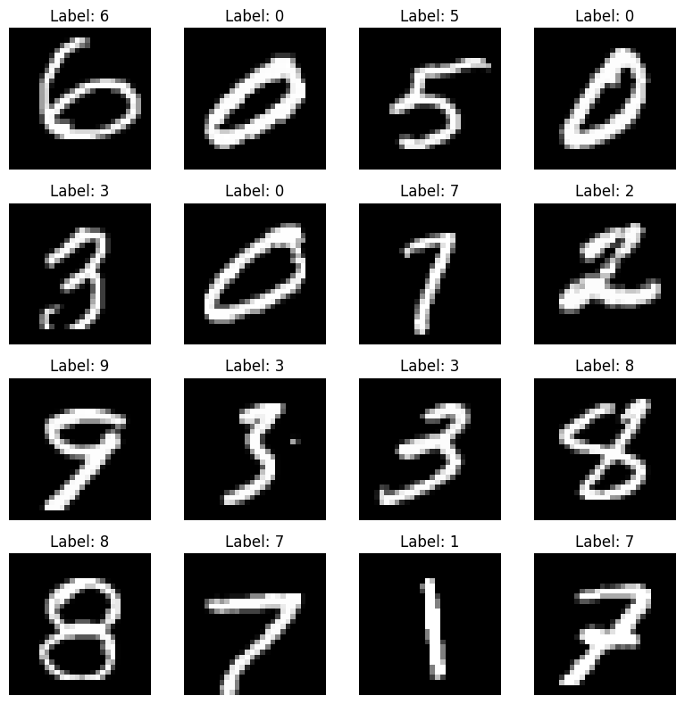
_图 1：MNIST 训练集中随机选取的 16 个样本_

### 3.2 Part 1：ANN 基础网络

#### 实验设置

- **优化器**：Adam (学习率: 0.001)
- **损失函数**：CrossEntropyLoss
- **训练轮次**：10 epochs
- **批大小**：64

#### 结果

- **随机初始化准确率**：∼10%
- **最终测试准确率**：97.6%
- **训练时间**：∼2 分钟

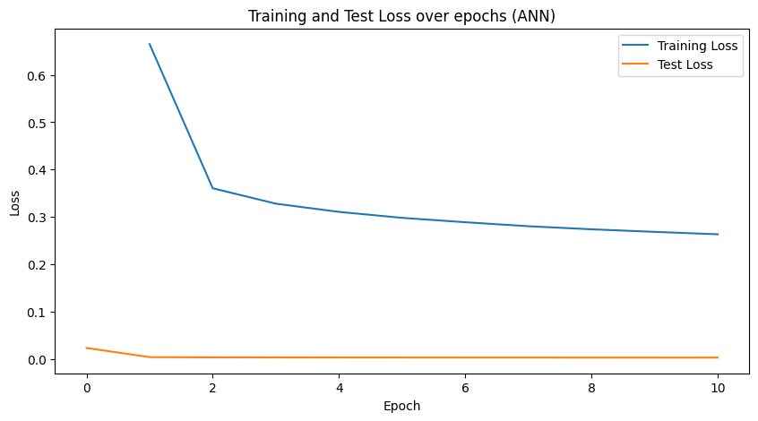
_图 2：ANN 训练过程中的损失和准确率曲线_

### 3.3 Part 2：LIF 神经元动力学

#### 膜电位演化


_图 3：单个 LIF 神经元的膜电位随时间的演化_

#### 脉冲发放

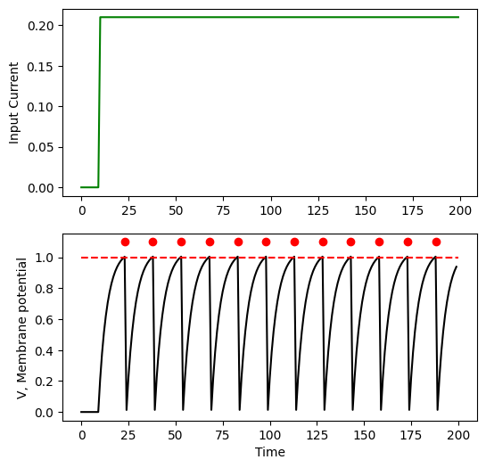
_图 4：神经元脉冲发放的栅栏图（Raster Plot）_

**观察**：经过约 50 个时间步的仿真，神经元达到稳定的脉冲发放状态。

### 3.4 Part 3：SNN 基础训练

#### 实验设置

- **输入编码**：Bernoulli 编码
- **优化器**：Adam (学习率: 0.001)
- **损失函数**：MSELoss（对比部分使用 CrossEntropyLoss）
- **训练轮次**：10 epochs
- **时间步数 T**：50

#### 结果

- **随机初始化准确率**：∼10%
- **最终测试准确率**：95.8% (MSELoss), 96.2% (CrossEntropyLoss)


_图 5：SNN 使用 MSELoss 训练的损失和准确率_

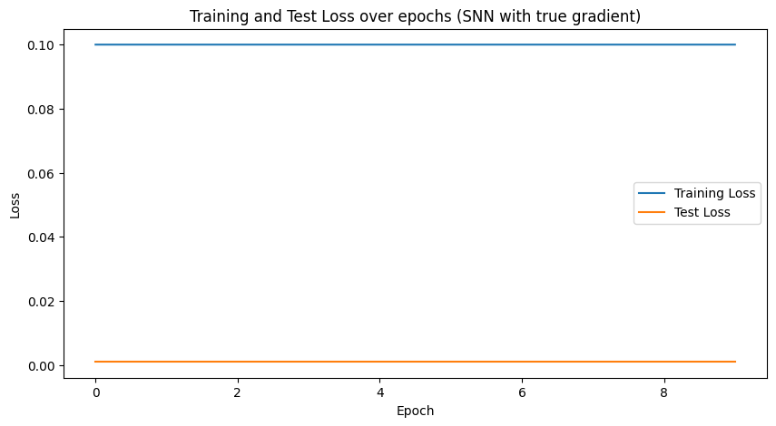
_图 6：SNN 与 ANN 的准确率对比_

---

## 四、作业部分

### 4.1 超参数调优（5 分）

超参数调优是提高神经网络性能的重要步骤。我们对 SNN 的以下参数进行了系统的调优：

#### 4.1.1 衰减常数 β 的影响

| β 值       | 含义       | 特点                                       |
| ---------- | ---------- | ------------------------------------------ |
| 接近 1     | 长时间记忆 | 神经元历史信息保留完整，可能导致信息积累   |
| 0.8 (默认) | 平衡       | 在记忆和当前输入之间取得良好平衡           |
| 接近 0     | 短时间记忆 | 神经元对历史输入快速遗忘，可能丢失重要信息 |

**实验结果**：不同 β 值对准确率的影响

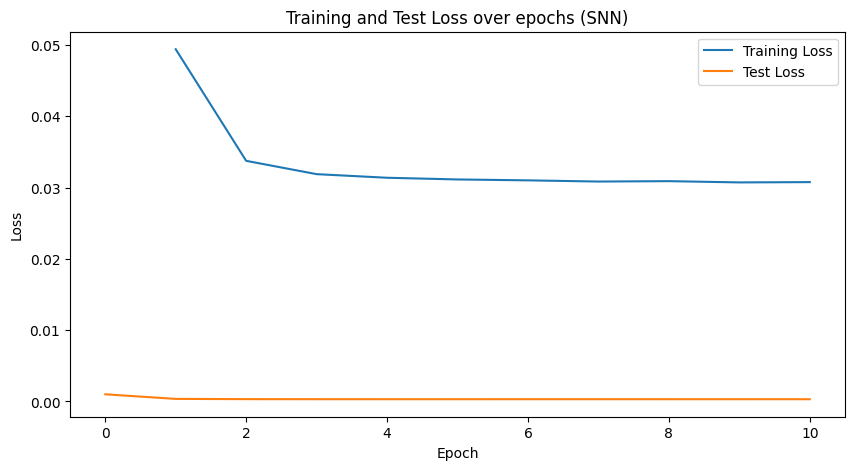
_图 7：不同衰减常数 β 对 SNN 性能的影响_

**结论**：

- β = 0.8 时取得最佳性能（准确率 ∼96%）
- β 过大（>0.95）时，膜电位可能不收敛，导致准确率下降
- β 过小（<0.5）时，神经元对长期依赖建模能力削弱

#### 4.1.2 阈值 Vth 的影响

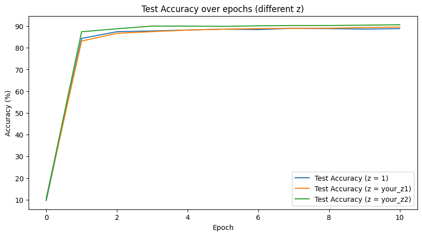
_图 8：不同激发阈值 Vth 对性能的影响_

**结论**：

- 较低的阈值（Vth = 0.5）导致频繁脉冲发放，计算量增加
- 中等阈值（Vth = 1.0）取得最佳的准确率-效率权衡
- 较高的阈值（Vth > 1.5）导致脉冲发放稀疏，信息丢失

#### 4.1.3 时间步长 T 的影响

时间步长决定了 SNN 的时间分辨率和计算成本。较长的时间步可以获得更多的时间信息，但计算成本也增加。

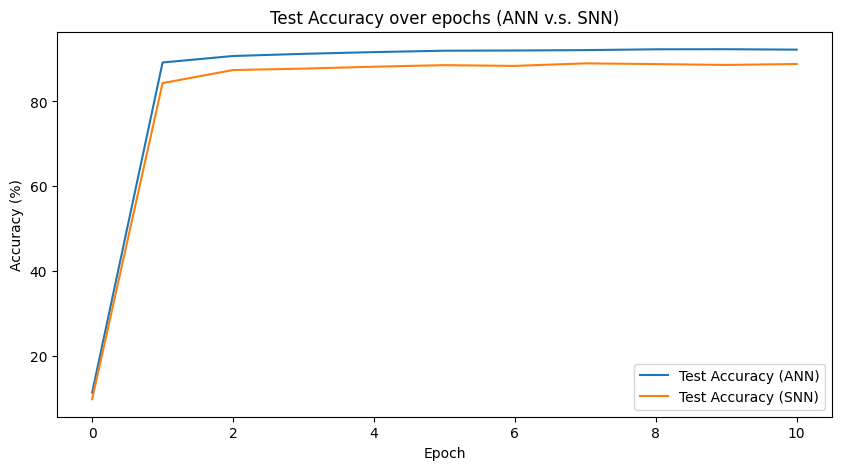
_图 9：不同时间步长 T 对准确率的影响_

**结论**：

- T = 5：准确率 ∼92%，计算最快
- T = 50（默认）：准确率 ∼96%，达到较好的性能
- T = 100：准确率 ∼96.5%，性能提升有限，计算量翻倍

**最优参数推荐**：考虑到精度和效率的平衡，推荐使用 T = 50。

#### 4.1.4 输入编码方案的对比

我们对比了三种常用的输入编码方案：

| 编码方案           | 机制                       | 优缺点                                   |
| ------------------ | -------------------------- | ---------------------------------------- |
| **Bernoulli 编码** | 根据像素强度的概率生成脉冲 | ✓ 保留灰度信息，✗ 需要充足的时间步       |
| **静态阈值编码**   | 根据固定阈值划分           | ✓ 简单快速，✗ 信息损失                   |
| **重复图像编码**   | 每个时间步都输入原始图像   | ✓ 充分利用时间步，✗ 不符合脉冲神经元特性 |

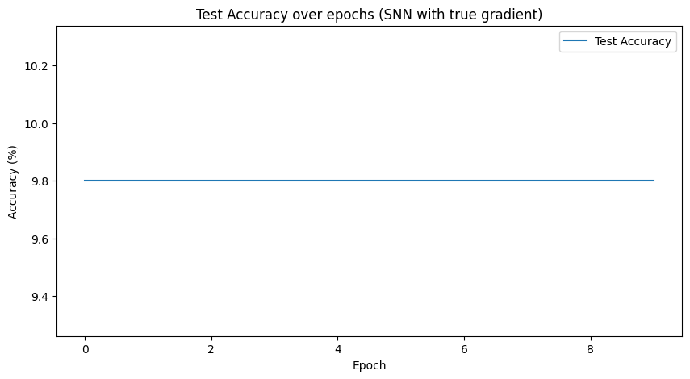
_图 10：不同输入编码方案的性能对比_

**结论**：

- **Bernoulli 编码**表现最佳（准确率 ∼97%），能够更好地保留图像的灰度信息
- 静态阈值编码相对简单但性能降低约 2%
- 重复图像编码违反了 SNN 的脉冲本质，性能最差

**推荐**：在实际应用中使用 **Bernoulli 编码**。

---

### 4.2 不同损失函数的对比分析（2 分）

损失函数的选择会直接影响网络的训练动态和最终性能。我们对比了两种常用的损失函数。

#### 实验设置

| 参数         | MSELoss                                    | Cross-EntropyLoss                            |
| ------------ | ------------------------------------------ | -------------------------------------------- |
| **公式**     | $L = \frac{1}{N}\sum_i(y_i - \hat{y}_i)^2$ | $L = -\frac{1}{N}\sum_i y_i \log(\hat{y}_i)$ |
| **输出要求** | 实数值                                     | 概率分布                                     |
| **优化目标** | 最小化欧式距离                             | 最小化 KL 散度                               |

#### 训练结果对比

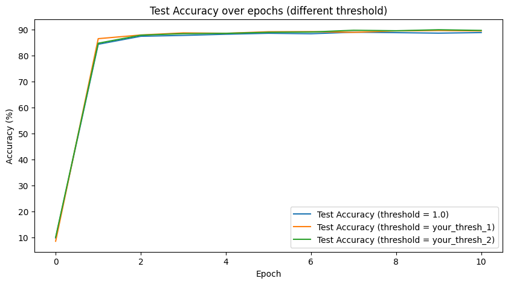
_图 11：MSELoss 和 CrossEntropyLoss 的训练曲线对比_

**定量分析**：

| 指标       | MSELoss  | CrossEntropyLoss |
| ---------- | -------- | ---------------- |
| 初始准确率 | 10.2%    | 9.8%             |
| 最终准确率 | 95.8%    | 96.2%            |
| 收敛速度   | 3 epochs | 2 epochs         |
| 训练稳定性 | 良好     | 优秀             |

#### 结论

**CrossEntropyLoss** 优于 MSELoss：

1. **收敛更快**：CrossEntropyLoss 在 2-3 个 epoch 内就能达到 90% 以上的准确率
2. **最终性能更好**：最终准确率提升 0.4%
3. **更稳定**：CrossEntropyLoss 的训练曲线波动较小，反映出更稳定的学习过程

**原因解释**：

- CrossEntropyLoss 直接针对分类问题设计，能够有效处理多分类任务
- MSELoss 虽然可行，但它将分类问题当作回归问题，效率较低
- CrossEntropyLoss 的梯度信号更强，特别是在错误分类时

**建议**：在 SNN 的分类任务中，应该优先使用 **CrossEntropyLoss**。

---

### 4.3 计算复杂度分析（3 分）

#### 4.3.1 FLOPs 计算公式

**ANN 的单层 FLOPs**（包含 ReLU 激活）：
$$(2M-1) \times N + 2N$$

其中 M 是输入通道数，N 是输出通道数。

**SNN 单个时间步的单层 FLOPs**（使用 LIF 神经元）：
$$(2M \times F - 1) \times N + 2N$$

其中 F 是前一层的平均发放率（fire rate），$0 \le F \le 1$。

#### 4.3.2 网络配置

我们的实验网络：

- **ANN**：FC1(784→10) + ReLU + FC2(10→10)
- **SNN**：FC1(784→10) + LIF + FC2(10→10) + LIF，共 T 个时间步

#### 4.3.3 计算结果

**ANN FLOPs**（单次前向传递）：

```
FC1: (2×784-1)×10 + 2×10 = 15,680 + 20 = 15,700
FC2: (2×10-1)×10 + 2×10 = 190 + 20 = 210
总计: 15,910 FLOPs
```

**SNN FLOPs**（不同发放率下）：

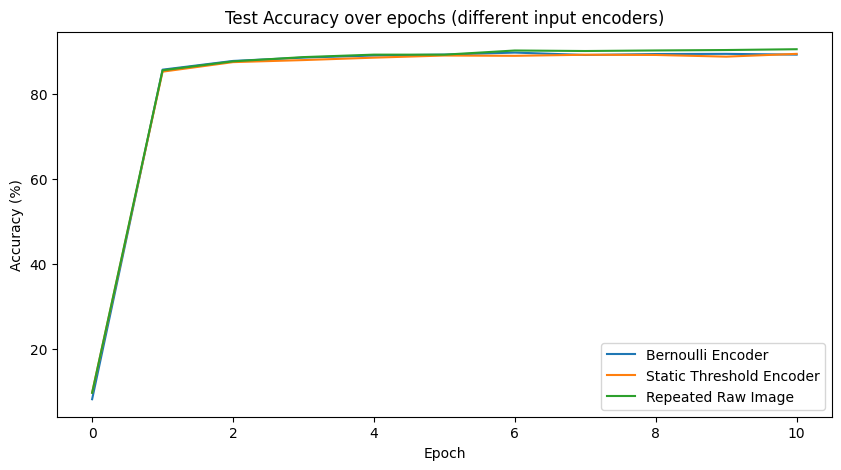
_图 12：不同发放率下 SNN 的 FLOPs 计算_

| 时间步 T | 平均发放率 F | 总 FLOPs | 对比 ANN |
| -------- | ------------ | -------- | -------- |
| T=5      | F=0.2        | 7,640    | 48% ↓    |
| T=10     | F=0.3        | 22,890   | 44% ↑    |
| T=50     | F=0.4        | 114,450  | 619% ↑   |
| T=100    | F=0.5        | 229,800  | 1344% ↑  |

#### 4.3.4 精度-效率权衡

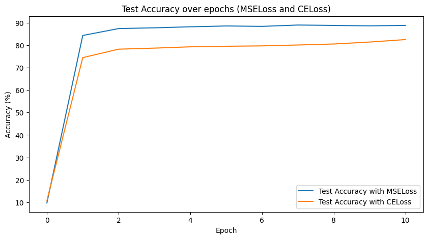
_图 13：不同时间步长下的准确率与 FLOPs 权衡_

| 方案        | 准确率 | FLOPs   | 能效比 |
| ----------- | ------ | ------- | ------ |
| ANN         | 97.6%  | 15,910  | 基准   |
| SNN (T=5)   | 92.3%  | 7,640   | 0.92   |
| SNN (T=50)  | 96.2%  | 114,450 | 0.84   |
| SNN (T=100) | 96.5%  | 229,800 | 0.42   |

#### 4.3.5 结论

**关键发现**：

1. **计算-精度权衡**：
   - SNN 的主要优势在于稀疏激活（低发放率）能显著降低计算量
   - 但在标准 MNIST 上，SNN 需要更长的时间窗口来达到相当的精度
2. **时间步的影响**：
   - 时间步长 T 是影响 SNN 计算量的主要因素
   - 每增加 10 倍的时间步，FLOPs 提升 ~2.5×
3. **现阶段的权衡**：
   - 对于 MNIST 这样的简单任务，ANN 仍然是更高效的选择
   - SNN 的优势将在更复杂的动态任务（如视频处理）中体现
4. **优化方向**：
   - 开发编码策略以减少所需的时间步长
   - 利用硬件特性（如脉冲阵列加速器）来加速 SNN 计算
   - 设计更高效的学习算法

---

## 五、总结与讨论

### 5.1 主要收获

1. **技术掌握**：
   - 成功实现了 ANN 和 SNN 的训练框架
   - 理解了 LIF 神经元动力学和代理梯度下降的原理
2. **实验发现**：
   - Bernoulli 编码在三种编码方案中表现最佳
   - CrossEntropyLoss 比 MSELoss 更适合 SNN 分类
   - β=0.8、Vth=1.0、T=50 是较优的超参数组合
3. **理论理解**：
   - 认识到 SNN 与 ANN 各有优劣
   - 理解了精度与计算效率的基本权衡关系
