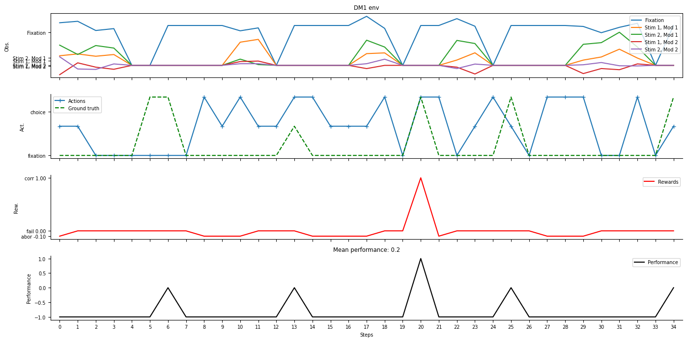
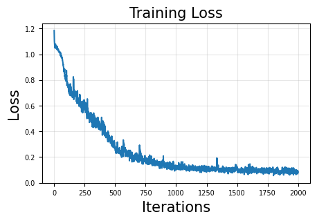
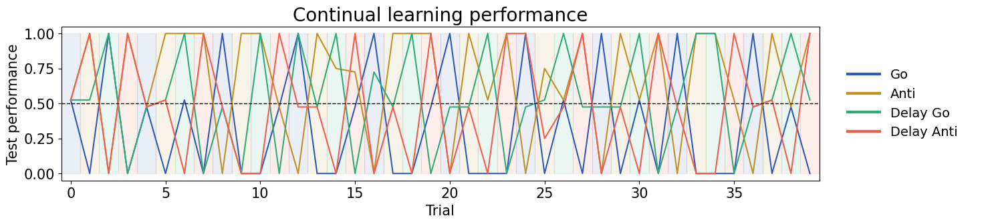
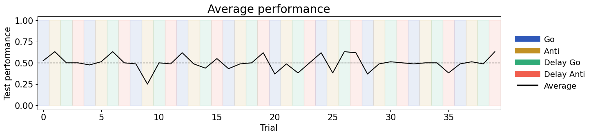
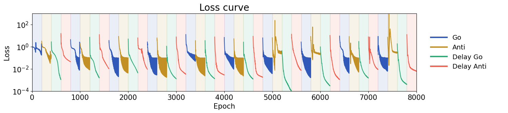
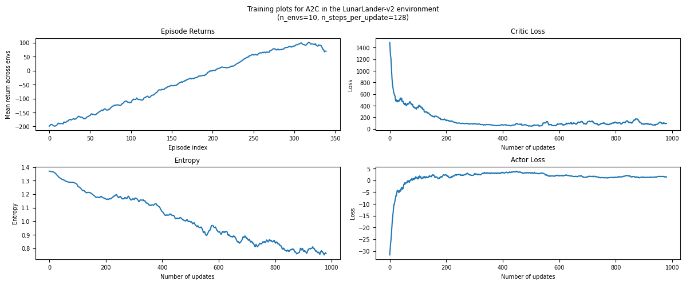

这次实验把认知神经科学中的任务环境和机器学习模型放在一起看。第一部分使用 `neurogym` 中的 Yang19 任务集合，让一个循环神经网络在多个认知任务之间共享参数；第二部分会转向 `gymnasium` 的 LunarLander，用 Advantage Actor-Critic 从奖励信号中学习控制策略。当前笔记先整理 Part 1 的任务内容、实现细节和已经得到的结果。

实验环境使用项目中的 `Python (lab2-clean)` kernel。这个环境中 `neurogym` 被固定在 `1.0.8`，因为课程 notebook 使用了旧版 API `from neurogym import get_collection`；新版 `neurogym 2.x` 不再从顶层导出这个函数，会导致 import error。`gymnasium` 固定在 `0.29.x`，并通过 `box2d` 与 `pygame` 支持后面 LunarLander 所需的 Box2D 环境。

## Part 1：多任务上下文决策与持续学习

Part 1 的核心问题是：同一个 RNN 能不能在多个认知任务之间共享表示，并根据任务上下文做出不同的行为？这些任务都可以看作 trial-based cognitive tasks。每个 trial 通常由 `fixation`、`stimulus`、`delay` 和 `decision` 等阶段组成。`fixation` 是准备和保持注视阶段，正确动作通常是保持不动；`stimulus` 阶段呈现感官证据或线索；`delay` 阶段刺激消失，模型必须依靠 hidden state 保留信息；`decision` 阶段才真正输出选择。RNN 的意义正是在这里体现出来的：它不是只根据当前输入分类，而是在时间过程中把 stimulus 写入 hidden state，在 delay 中维持，再在 decision 阶段读出。

### DM1 单任务环境

实验先单独构造了 `yang19.dm1-v0` 环境。DM1 表示 Decision-Making Modality 1，模型会收到两个 modality 的刺激输入，但决策时只应该使用 modality 1 的证据。这里设置 `dt = 100 ms`，`dim_ring = 2`，因此动作空间中有一个 fixation 动作和两个 choice 动作。

notebook 中打印出的 DM1 trial timing 是：`fixation` 从 200 到 500 ms 均匀采样，`stimulus` 从 200、400、600 ms 中随机选择，`decision` 固定为 200 ms。观察空间是 `Box(-inf, inf, (5,), float32)`，对应 1 个 fixation channel 加上两个 modality 各 2 个刺激 channel；动作空间是 `Discrete(3)`，其中 `0` 是 fixation，`1` 和 `2` 是两个选择。



上图展示了 5 个 DM1 示例 trial。第一行是 observation，可以看到 fixation signal 和不同 stimulus channel 随时间出现；第二行是 action 与 ground truth，绿色虚线表示正确选择，蓝色线表示 agent 动作；后两行分别记录 reward 和 performance。这个图的作用不是展示训练结果，而是帮助理解任务的时序结构：模型在 stimulus 阶段接收证据，在 decision 阶段才应该输出选择。

### Yang19 多任务环境

随后 notebook 使用 `get_collection("yang19")` 取出 Yang19 任务集合，并将所有任务通过 `ScheduleEnvs` 组合成一个多任务环境。这里使用 `RandomSchedule`，每个 trial 随机抽取一个任务；同时设置 `env_input=True`，把当前任务编号以 one-hot 形式拼接到 observation 后面。这样，一个网络虽然共享参数，但可以通过 task identity 判断当前该执行哪一套规则。

多任务环境的输出显示 observation size 是 `25`，action size 是 `3`。这个维度可以这样理解：底层任务本身的 observation 包含 fixation 与刺激通道，而 `env_input=True` 会额外加入 Yang19 中 20 个任务的 one-hot 标识，所以最终输入维度变成 25。动作仍然是三类：保持 fixation、选择 1、选择 2。

### SimpleRNN 模型实现

实验中的模型是手写的单层 RNN，而不是直接调用 `nn.RNN`。输入张量形状是 `(T, B, D_in)`，其中 `T` 是时间步数，`B` 是 batch size，`D_in` 是输入维度。每次循环取出一个时间步 `x[t]`，形状变成 `(B, D_in)`，也就是同时处理 batch 中所有 trial 在第 `t` 个时间点的输入。

RNN 中有三组主要参数。`input_layer = nn.Linear(input_size, hidden_size)` 负责把当前输入投影到 hidden space；`self.W` 和 `self.bias` 负责把上一时刻 hidden state 变换成 recurrent input；`output_layer = nn.Linear(hidden_size, output_size)` 负责从 hidden state 读出动作 logits。每个时间步的更新可以概括为：

```python
input_gate = self.input_layer(x[t])
rec_input = torch.mm(h, self.W.t()) + self.bias
new_h = self.act(input_gate + rec_input)
outputs[t] = self.output_layer(new_h)
h = new_h
```

这里的 `Softplus` 激活函数是 `log(1 + exp(x))`，可以看作平滑版 ReLU。它在输入很大时近似线性，在输入很小时接近 0，并且输出非负。放在神经科学任务中，Softplus 的非负输出也可以被理解为类似 firing rate 的活动水平。没有非线性时，RNN 只是循环线性系统；加入 Softplus 后，模型可以学习更复杂的状态更新和决策边界。

模型返回两个对象：`outputs` 和 `hs`。`outputs` 的形状是 `(T, B, act_size)`，表示每个时间步对动作类别的 logits；`hs` 的形状是 `(T, B, hidden_size)`，保存每个时间步的 hidden state，后面可以用于分析 RNN 动态。

### 多任务监督学习训练

训练数据由 `ngym.Dataset(env, batch_size=64, seq_len=100)` 生成。每个 batch 包含 64 条长度为 100 的序列，target 是每个时间步的正确动作。训练目标是 cross entropy：

```python
outputs_flat = outputs.reshape(-1, outputs.size(2))
targets_flat = targets.reshape(-1)
loss = criterion(outputs_flat, targets_flat)
```

因为 trial 中很长一段时间都处在 fixation 阶段，如果直接训练，模型可能过度偏向输出 action 0。代码中使用 `class_weights = [0.05, 1.0, 1.0]`，降低 fixation 类的 loss 权重，让 decision 阶段的选择错误更明显地影响训练。

当前 notebook 在 CPU 上训练了 2000 个 iteration，用时约 3 分 18 秒。训练完成后，loss 曲线整体下降，说明 RNN 能够从混合任务数据中学习到可用的时序决策规则。



### 多任务评估结果

训练后，notebook 对每个 Yang19 任务分别评估了 100 个 trial。总体平均 performance 是 `0.931`，说明单个 RNN 在带有 task identity 的情况下能够比较好地覆盖多个任务。已经得到的任务级准确率如下：

| Task                   | Accuracy |
| ---------------------- | -------: |
| `yang19.go-v0`         |   1.0000 |
| `yang19.rtgo-v0`       |   1.0000 |
| `yang19.dlygo-v0`      |   1.0000 |
| `yang19.anti-v0`       |   1.0000 |
| `yang19.rtanti-v0`     |   1.0000 |
| `yang19.dlyanti-v0`    |   1.0000 |
| `yang19.dm1-v0`        |   0.8900 |
| `yang19.dm2-v0`        |   0.9400 |
| `yang19.ctxdm1-v0`     |   0.7800 |
| `yang19.ctxdm2-v0`     |   0.7500 |
| `yang19.multidm-v0`    |   0.9300 |
| `yang19.dlydm1-v0`     |   0.9800 |
| `yang19.dlydm2-v0`     |   0.9800 |
| `yang19.ctxdlydm1-v0`  |   0.6900 |
| `yang19.ctxdlydm2-v0`  |   0.8000 |
| `yang19.multidlydm-v0` |   0.8800 |
| `yang19.dms-v0`        |   1.0000 |
| `yang19.dnms-v0`       |   1.0000 |
| `yang19.dmc-v0`        |   1.0000 |
| `yang19.dnmc-v0`       |   1.0000 |

结果上看，比较简单的 go/anti、delay go/anti 和 matching 类任务几乎都达到满分；相对困难的是 contextual decision-making 类任务，尤其是 `ctxdlydm1`、`ctxdm2`、`ctxdm1`。这比较符合任务结构：contextual task 不只是判断刺激强弱，还要根据上下文选择应该关注哪个 modality；delay contextual task 还额外要求模型在刺激消失后保持相关证据，因此对 hidden state 的表达能力要求更高。

### 持续学习设置

持续学习部分不再把所有任务混在一起随机训练，而是选取 `go`、`anti`、`dlygo`、`dlyanti` 四个任务，让同一个网络按顺序学习。代码中设置 `epoch_per_task = 200`，`repeat_times = 10`，也就是模型会反复经历如下顺序：

```text
go -> anti -> dlygo -> dlyanti
```

每学完一个任务，代码会在所有四个任务上测试 performance，并保存到 `test_perfs` 中。这个设计是为了观察 catastrophic forgetting：当模型只在当前任务上更新参数时，新任务的梯度可能覆盖旧任务已经学到的参数结构，于是当前任务表现上升，而之前任务表现下降。

这部分代码实现上有一个细节：四个单任务环境本身的 observation size 是 `5`，而模型输入被设置为 `ob_size + len(envs)`，也就是 `5 + 4 = 9`。训练和测试时都会手动把当前任务的 one-hot 向量拼接到 observation 后面。这样网络知道当前处于哪个任务，但所有任务仍然共享同一套 RNN 参数，所以它仍然会受到任务间干扰。每次切换到新任务时，代码会重新创建 Adam optimizer，但不会重置网络参数；因此 `repeat_times = 10` 不是 10 次独立实验，而是同一个网络连续经历 10 轮任务序列。

训练日志显示，每个任务内部训练 200 个 epoch 后 loss 通常会明显下降。例如 `dlygo` 经常可以从约 `0.1-0.3` 降到接近 `0.001`，`dlyanti` 也能在单个任务阶段内降到很低。但切换任务时 loss 经常重新升高，有些阶段甚至出现很大的瞬时 loss，例如第 9 轮训练 `anti` 时前 100 个 epoch 的平均 loss 达到 `108.94`，随后 200 epoch 平均又降到 `0.33`。这说明模型不是完全学不会当前任务，而是每次任务切换都会对已有参数状态造成明显冲击。



上图是四个任务的测试 performance 曲线。横轴标签写的是 `Trial`，但更准确地说，它表示“每完成一个任务训练阶段后的评估点”：一共 10 轮，每轮 4 个任务，所以有 40 个评估点。背景颜色表示刚刚训练的是哪个任务。曲线剧烈上下摆动，很多任务在某些阶段可以达到接近 `1.0`，但在训练其他任务后又迅速跌到接近 `0` 或 chance level 附近。这是持续学习中 catastrophic forgetting 的典型表现：模型刚被优化到适合当前任务的参数区域，随后新任务的梯度又把参数推离旧任务所需的区域。



平均 performance 图进一步说明了这一点。黑线大多数时候围绕 `0.5` 的虚线附近波动，偶尔升到约 `0.6`，也会跌到约 `0.25-0.4`。由于四个任务都是二选一决策，`0.5` 大致可以看作 chance level。也就是说，虽然网络在某些单个任务阶段能把当前任务 loss 压低，但它并没有稳定地同时保持四个任务的能力；从整体平均表现看，持续学习效果明显弱于前面的多任务混合训练。



loss 曲线使用 log scale，并按任务阶段染色。每个彩色区间内部的 loss 大多呈下降趋势，说明在给定当前任务数据时，网络仍然能快速拟合该任务；但相邻区间之间经常出现跳升，尤其是切换到 `anti` 或 `dlyanti` 时更明显。这和 performance 曲线互相印证：问题不在于优化器完全无法训练，而在于顺序训练时新任务不断覆盖旧任务的解。

总体上，这个持续学习结果是合理的，也正好回答了作业关于 catastrophic forgetting 的问题。和前面多任务学习平均 performance `0.931` 相比，持续学习的平均表现长期停留在 chance level 附近，说明仅靠 task identity 输入和共享 RNN 参数还不足以解决遗忘。任务之间存在规则冲突，例如 `go` 要朝刺激方向反应，而 `anti` 要朝相反方向反应；`dlygo` 和 `dlyanti` 又额外要求在 delay 中保持 stimulus 信息。当模型只看当前任务时，梯度会优先服务当前规则，从而破坏旧规则对应的 hidden dynamics 和 readout。

可能的缓解思路包括 replay、regularization 和 task-specific structure。Replay 的想法是在训练新任务时混入旧任务样本，让梯度同时照顾旧任务；regularization 方法如 EWC 会限制对旧任务重要的参数发生大幅变化；task-specific modules 或 gating 则让不同任务使用部分独立的参数或动态通路，减少任务间干扰。多任务学习和持续学习的差别也正在这里：多任务学习中模型持续看到所有任务，梯度会在多个目标之间折中；持续学习中模型一段时间只看到一个任务，因此更容易用新知识覆盖旧知识。

## Part 2：强化学习 A2C

Part 2 使用 `gymnasium` 的 `LunarLander-v2` 环境训练 Advantage Actor-Critic。和 Part 1 不同，这里没有每个时间步的正确动作标签，agent 只能通过 reward 学习。LunarLander 的 observation 是 8 维向量，包括飞船位置、速度、角度、角速度以及两条腿是否接触地面；action space 是 4 个离散动作，分别是不操作、喷左侧姿态发动机、喷主发动机、喷右侧姿态发动机。本次运行中 notebook 输出的环境信息是 `obs shape: 8`，`action shape: 4`。

强化学习问题可以形式化为一个马尔可夫决策过程。智能体在状态 $s_t$ 下根据策略 $\pi_\theta(a_t \mid s_t)$ 选择动作 $a_t$，环境返回奖励 $r_{t+1}$ 和下一个状态 $s_{t+1}$。目标不是模仿标签，而是最大化折扣回报：

$$
G_t = \sum_{k=0}^{\infty} \gamma^k r_{t+k+1}.
$$

其中 $\gamma$ 是 discount factor。$\gamma$ 越接近 1，模型越重视长远回报；$\gamma$ 越小，模型越短视，更强调即时奖励。LunarLander 中“安全降落”是一个延迟目标，如果 $\gamma$ 太小，agent 可能只优化眼前的姿态或燃料惩罚，而不够重视最终着陆结果。本实验使用 `gamma = 0.999`，使价值估计能覆盖较长时间尺度。

A2C 的核心思想是同时学习 actor 和 critic。Actor 是策略网络，输出每个动作的 logits，再通过 categorical distribution 采样动作：

$$
\pi_\theta(a_t \mid s_t).
$$

Critic 是价值网络，估计当前状态未来能获得的期望回报：

$$
V_\phi(s_t) \approx \mathbb{E}[G_t \mid s_t].
$$

Actor 的更新方向由 advantage 决定。Advantage 衡量“这个动作比当前状态的平均水平好多少”：

$$
A_t = Q(s_t, a_t) - V(s_t).
$$

如果 $A_t > 0$，说明这个动作比预期更好，应该提高它的概率；如果 $A_t < 0$，说明这个动作比预期更差，应该降低它的概率。由于真实的 $Q(s_t,a_t)$ 不直接可得，notebook 使用 Generalized Advantage Estimation 来近似 advantage。

根据作业更正后的公式，单步 temporal-difference error 是：

$$
\delta_t = r_{t+1} + \gamma \cdot mask_t \cdot V(s_{t+1}) - V(s_t).
$$

这里的 `mask_t` 用来处理 episode 结束。如果 episode 在当前步终止，后续状态价值不应该继续 bootstrap，因此 mask 为 0；否则为 1。GAE 再把多个时间步的 TD error 按指数衰减累积起来：

$$
A_t = \delta_t + \gamma \lambda \cdot mask_t \cdot A_{t+1}.
$$

其中 $\lambda$ 控制 bias-variance tradeoff。$\lambda = 0$ 时主要依赖一步 TD，方差较低但 bias 较大；$\lambda = 1$ 时更接近 Monte Carlo return，bias 较低但方差较大。本实验使用 `lam = 0.95`，是在稳定性和长期信用分配之间取折中。

### 2.5：`gamma` 和 `lam` 的作用

作业中问到 `gamma` 和 `lam` 在学习过程中分别起什么作用，以及改变它们会发生什么。可以把这两个超参数理解成 advantage 估计中的两个时间尺度控制器：`gamma` 决定奖励本身被看多远，`lam` 决定 TD error 被平滑累计多远。

`gamma` 是 discount factor，直接作用在未来奖励上。在折扣回报

$$
G_t = r_{t+1} + \gamma r_{t+2} + \gamma^2 r_{t+3} + \cdots
$$

中，越远的奖励会乘上越高次的 $\gamma$。当 `gamma` 接近 1 时，未来奖励衰减很慢，agent 会更重视长期结果；当 `gamma` 较小时，未来奖励很快被压小，agent 会更偏向眼前奖励。对 LunarLander 来说，最终安全着陆或坠毁的奖励出现在比较晚的时候，因此较大的 `gamma` 有助于把“现在的姿态控制”和“未来是否安全着陆”联系起来。如果 `gamma` 太小，agent 可能只学到局部行为，比如暂时降低速度或少用燃料，但不一定能为最终降落负责；如果 `gamma` 太接近 1，长期回报估计会更依赖很远的未来，训练信号可能方差更大，critic 也更难稳定估计。

`lam` 是 GAE 中的 trace decay 参数，不直接改变环境奖励，而是改变 advantage 的估计方式。GAE 可以写成多个 TD error 的加权和：

$$
A_t
= \delta_t
+ \gamma\lambda \delta_{t+1}
+ (\gamma\lambda)^2 \delta_{t+2}
+ \cdots .
$$

因此 `lam` 越大，advantage 会纳入越多未来时间步的 TD error，更接近 Monte Carlo return；`lam` 越小，advantage 更接近一步 TD error。如果 `lam = 0`，估计主要看一步 TD，更新更稳定、方差较低，但因为强烈依赖 critic 当前的 value estimate，所以 bias 较大；如果 `lam = 1`，估计会尽量使用完整 rollout 中的长期信息，bias 较低，但由于 rollout reward 本身波动较大，variance 会升高。实验中使用 `lam = 0.95` 是常见折中：既保留多步回报的信息，又不完全退化成高方差的 Monte Carlo 估计。

两者的区别也很重要。`gamma` 改变的是“未来奖励在目标里有多重要”，所以它影响任务目标本身的时间视野；`lam` 改变的是“我们怎样用采样到的 TD error 来估计 advantage”，所以它主要影响训练信号的 bias 和 variance。实际调参时，如果发现 agent 太短视，可以考虑增大 `gamma`；如果训练曲线噪声很大、actor 更新不稳定，可以适当降低 `lam`；如果策略学不到延迟回报，可能需要增大 `lam` 或增加 rollout 长度，让 advantage 包含更长时间的信息。

Critic 的目标是让价值估计更接近实际 advantage 对应的回报信号，因此使用 advantage 的平方均值作为 loss：

$$
\mathcal{L}_{critic} = \mathbb{E}[A_t^2].
$$

Actor 使用 policy gradient。代码中保存每步采样动作的 log probability，并用 detached advantage 作为权重：

$$
\mathcal{L}_{actor}
= -\mathbb{E}\left[A_t \log \pi_\theta(a_t \mid s_t)\right]
- c_{ent}\mathbb{E}\left[\mathcal{H}(\pi_\theta(\cdot \mid s_t))\right].
$$

第一项是策略梯度项，第二项是 entropy bonus。Entropy 越高，策略越随机，探索越充分；训练早期保留较高 entropy 可以防止策略过早塌缩到某个动作。本实验使用 `ent_coef = 0.01`，也就是在优化任务奖励的同时，给策略随机性一个小的鼓励。

实现上，代码使用 `n_envs = 10` 个并行 LunarLander 环境，每次 update 收集 `n_steps_per_update = 128` 步 rollout。每个 rollout 中保存 rewards、action log probabilities、value predictions、entropies 和 masks，然后计算 GAE、critic loss 和 actor loss。Actor 和 critic 是两个独立的 MLP，结构都是 `8 -> 32 -> 32 -> output`，critic 输出一个 value，actor 输出 4 个动作 logits。优化器使用 RMSprop，并且 critic learning rate 设置为 `0.005`，actor learning rate 设置为 `0.001`，让 value function 能更快追上回报尺度。

本次训练完整跑了 `n_updates = 1000`，耗时约 4 分 17 秒。训练结束后生成了四条曲线：episode return、entropy、critic loss 和 actor loss。



Episode return 从一开始约 `-200` 逐步上升，最后达到接近 `100` 的水平，说明 agent 已经从完全不稳定的随机控制学到了更合理的降落策略。虽然还没有达到 LunarLander 通常认为 solved 的 `200` 分标准，但曲线趋势是明显向上的，说明训练是有效的。

Critic loss 在训练初期非常高，随后快速下降并在较低范围内波动。这符合预期：一开始 critic 对状态价值几乎没有概念，TD error 很大；随着 rollout 经验增加，value network 对未来回报的估计逐渐稳定，critic loss 下降。后期仍然有波动，是因为策略本身也在变化，critic 需要不断追踪新的状态分布和回报分布。

Entropy 从约 `1.38` 逐渐下降到约 `0.75`。对 4 个离散动作而言，完全均匀策略的 entropy 约为 $\log 4 \approx 1.386$，所以训练初期几乎是随机探索；随着策略学到哪些动作更有用，动作分布变得更集中，entropy 自然下降。这说明 actor 没有一开始就塌缩，而是在探索之后逐步形成偏好的动作选择。

Actor loss 一开始是较大的负值，随后快速回到接近 0 到正值附近的小范围波动。Actor loss 的绝对数值本身不像 supervised loss 那样容易直接解释，因为它依赖 advantage 的符号、log probability 和 entropy bonus；更重要的是结合 return 与 entropy 看。如果 return 上升、entropy 合理下降，同时 actor loss 没有发散，通常说明策略更新是正常的。

训练完成后，notebook 又用训练好的 agent 录制了 3 个 showcase episode，保存为：

```text
videos/lunarlander_showcase-episode-0.mp4
videos/lunarlander_showcase-episode-1.mp4
videos/lunarlander_showcase-episode-2.mp4
```

这说明完整 pipeline 已经跑通：环境交互、rollout 采样、GAE 估计、actor/critic 更新、曲线记录和视频展示都完成了。总体来看，本次 A2C 训练没有数值崩溃，曲线方向合理，但训练步数仍然偏少，最终 return 还没有达到 200 分的 solved 标准。如果要进一步提升，可以增加 `n_updates`，调小 actor learning rate 以减少策略震荡，或者使用 advantage normalization、reward normalization 等技巧提高稳定性。
