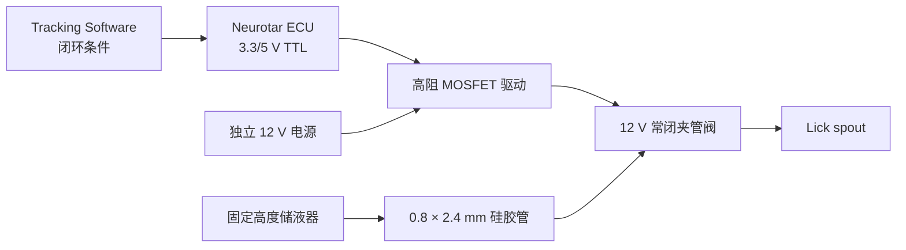

> [!summary] 推荐方案
> 第一阶段采用固定高度储液器、`0.8 × 2.4 mm` 硅胶管、12 V 常闭夹管阀、高阻 MOSFET 驱动和独立 `12 V / ≥1 A` 电源。优先考虑 HP20-1NC24，升级方案为 Takasago PS-0815NC。Neurotar ECU 只提供 TTL 控制信号，不直接驱动阀线圈。

## 1. 目标与接口约束

目标是在 Mobile HomeCage Large Tracking Software 中，根据 Zone、Speed、时间或外部输入自动触发液体奖励，并为后续气吹刺激预留独立通道。

系统应满足：

- 触发延迟低且重复性可量化；
- 与 ECU TTL 电平兼容；
- 阀线圈功率不加载到 ECU I/O；
- 奖励量可标定并可在实验间复现；
- 液体和气吹执行链路互不干扰。

| 项目         | ECU 能力或限制                                    | 设计影响                                 |
| ------------ | ------------------------------------------------- | ---------------------------------------- |
| I/O 数量     | 6 个可配置 TTL I/O                                | 可分别分配奖励、气吹、舔舐输入和同步信号 |
| 输出电压     | 1.8–5.0 V 可调                                    | 按外部驱动输入选择 3.3 V 或 5 V          |
| 端口串联电阻 | 每端口约 470 Ω                                    | 外部触发输入必须为高阻                   |
| 推荐输出负载 | 保持 TTL/CMOS 电平时电流 `<2 mA`                  | 不得直接驱动 12 V 电磁阀                 |
| 输出模式     | Pulse short、edge 等                              | 液体奖励优先使用有限时长脉冲             |
| 闭环动作     | Air puff、Liquid reward、TTL pulse、edge high/low | 可由软件条件直接触发                     |

官方 lick port / air puff 附件要求 3.3 V TTL trigger，标称分配能力约 `250 µL/s`、典型液滴约 `50 µL`、build-up time 约 `0.2 s`。[W1] 这些参数是附件能力而非实验推荐量；小鼠行为实验的单次奖励通常为数微升至十余微升，应依据实验方案标定。

## 2. 方案选择依据

固定高度储液器配合常闭电磁阀，是 head-fixed mouse、VR、Go/No-Go 和 2AFC 装置中的常见方案。奖励量主要由储液压头、管路阻力、阀门动态和开阀时间共同决定。

| 代表性工作                                           | 供液方式                               | 阀与控制                      | 奖励量或要点                   |
| ---------------------------------------------------- | -------------------------------------- | ----------------------------- | ------------------------------ |
| Frontiers Cell Neurosci., 2017 [L1]                  | 重力供液                               | 12 V Takasago 夹管阀；Arduino | 奖励量由开阀时间和储液高度决定 |
| Automating licking bias…, 2023 [L2]                  | 10 mL 注射器，高于 lick spout 约 50 cm | NResearch 161T011；Arduino    | 典型重力供液装置               |
| Dynamics of cortical contrast adaptation…, 2023 [L3] | 重力储液                               | NResearch/Neptune 161T011     | 约 4–5 µL/reward               |
| Cortical dopaminergic signaling…, 2025 [L4]          | 重力供液                               | Lee LHDA123115H               | 中央约 2 µL，侧边约 3 µL       |
| Fast dendritic excitations…, 2025 [L5]               | 高位储液器                             | Lee LFMX0524000A              | 约 5 µL/reward                 |
| Enhanced Population Coding…, 2019 [L6]               | 重力供液                               | Clippard EV-2-24；TTL 控制    | 双 lick spout                  |

相较蠕动泵，重力供液加常闭阀结构简单、响应快、无持续电机振动，并能用脉宽直接控制液量。其主要局限是液量受储液高度、液面和管路状态影响，因此必须固定几何并定期标定。

## 3. 执行器比较

| 方案               | 关键规格                                      | ECU 直驱   | 优点                       | 局限                                |
| ------------------ | --------------------------------------------- | ---------- | -------------------------- | ----------------------------------- |
| HP20-1NC24         | 12 V、2.9 W、常闭、适配 0.8 × 2.4 mm 管 [H1]  | 否         | 国内易采购；液体不接触阀体 | 开关延迟需实测；必须做脉宽—液量标定 |
| Takasago PS-0815NC | 12/24 V、3 W、常闭、适配 0.8 × 2.4 mm 管 [H2] | 否         | 工业规格明确，相关应用成熟 | 成本高、采购周期较长                |
| NResearch 161T011  | 行为实验文献常见                              | 通常否     | 资料和使用案例多           | 国内采购不便                        |
| Lee LHDA/LFMX      | 微型高速流体阀                                | 通常否     | 小体积控制性能较好         | 驱动、采购和接口更复杂              |
| TTL 蠕动泵         | 依型号而定                                    | 依型号而定 | 不依赖重力压头，流量可调   | 噪声与振动更大，启停动态较慢        |

当前优先选择 HP20-1NC24，依据是常闭夹管结构、低压重力供液适配性和采购便利性。TTL 到 12 V 线圈电流的转换由独立 MOSFET 模块完成。

## 4. 推荐硬件架构

### 4.1 液路

1. 使用 20–100 mL 注射器或小型储液瓶，并固定在 lick spout 上方的可复现高度。
2. 使用与阀匹配的 `ID 0.8 mm / OD 2.4 mm` 硅胶管。
3. 软管穿过常闭夹管阀：断电时夹紧，通电时释放。
4. 缩短阀后管路以减少延迟和残滴；若任务对声音敏感，应将阀远离动物并隔音。
5. 实验前执行 Flush，排尽气泡并检查泄漏。

### 4.2 电气控制

| 部件             | 建议规格                                                      | 作用                      |
| ---------------- | ------------------------------------------------------------- | ------------------------- |
| Neurotar ECU I/O | 3.3 V 或 5 V；Output；Pulse short                             | 仅输出逻辑信号            |
| MOSFET 驱动      | 支持 3.3 V；输入电流 `<2 mA` 或输入阻抗 `≥10 kΩ`；负载 `≥1 A` | 将 TTL 转换为线圈电流开关 |
| 直流电源         | 稳压 12 V，`≥1 A`                                             | 独立为阀线圈供电          |
| 续流保护         | 模块内置 flyback diode，或在线圈两端外接二极管                | 吸收关断反向感应电压      |
| 信号线           | ECU 端使用 SMA，按驱动板接口转接                              | 提供 TTL 和可靠共地       |

HP20-1NC24 功率约为 2.9 W，在 12 V 下电流约为 `0.24 A`，因此 12 V/1 A 电源具有足够余量。ECU 不承担该电流，只控制 MOSFET 的导通状态。

### 4.3 MOSFET 选型检查表

- 明确支持 3.3 V 逻辑高电平；否则将 ECU 输出设为 5.0 V。
- 输入为高阻逻辑端，不要求 ECU 驱动高电流 LED 或光耦。
- 功率侧支持 12 V 直流感性负载，额定连续电流至少 1 A。
- 输入持续为 HIGH 时可持续导通。
- 明确 `HIGH → ON`、`LOW → OFF` 的极性；必要时在软件中启用 `Invert TTL levels`。
- 具备续流保护；若无内置二极管，在线圈两端外接 flyback diode。

模块标注 `PWM control` 通常不妨碍本项目使用：此处不做高频调速，只将 TTL HIGH/LOW 作为数字开关信号。

## 5. Neurotar 软件配置

### 5.1 I/O Configuration

1. 打开 **Menu → Settings → I/O Configuration**。
2. 选择一个输出端口，建议先使用 I/O 1。
3. 设置 `Port direction = Output`、`Sync type = Pulse short`。
4. I/O voltage 初始设为 3.3 V；仅在驱动模块要求时改为 5.0 V。
5. 设置 `Port enabled = Enabled`。
6. 默认不反转极性；实测逻辑相反时再启用 `Invert TTL levels`。

I/O 电压按端口对配置（1&2、3&4、5&6）。同一端口对上的设备若要求不同电压，应重新分配端口。

### 5.2 Stimulus Conditions

- Variable 可选择 Zone、Speed、Angle to wall、Since start、Since last activation 或 Ports active。
- Detection 定义触发条件，Reset 定义再次触发前的复位条件。
- Action type 可选择 Liquid reward、TTL pulse、Air puff 或 TTL edge high/low。
- 外部阀初次联调使用 TTL pulse，便于用示波器或 LED 检查毫秒级脉宽。
- 使用 Liquid reward 前必须完成 Dispensing calibration。
- 设置 Since last activation 或 Reset 条件，限制最短奖励间隔，避免动物停留在奖励区时连续出液。

## 6. 液量标定

1. 固定储液器高度、软管长度、阀门和 lick spout 位置。
2. Flush 管路并排除全部气泡。
3. 选择奖励输出端口并设为 Active。
4. 先以较长脉冲确认阀正常开关，再测试 20、50、100、200 ms 等脉宽；实际范围以阀最小响应时间为准。
5. 每个脉宽重复 30–100 次，将液体收集到称量皿。
6. 对水可近似按 `1 mg ≈ 1 µL` 换算平均单次体积。
7. 记录均值、标准差、CV、漏触发、残滴和持续渗漏。
8. 在软件的 Disp. time 与 Meas. vol. 中录入实测值并保存标定。

| 测试项       | 记录内容                      | 目的                                 |
| ------------ | ----------------------------- | ------------------------------------ |
| 最小动作脉宽 | 20/50/100/200 ms 是否稳定开阀 | 确定低脉宽死区                       |
| 目标奖励量   | 例如 5–10 µL 对应的脉宽       | 确认可达范围；实际目标由实验方案决定 |
| 重复性       | `n ≥ 30` 的均值、SD、CV       | 判断是否满足正式闭环需求             |
| 高度敏感性   | 储液高度改变 ±5 cm 后复测     | 评估压头变化影响                     |
| 液面敏感性   | 满液与低液位复测              | 判断是否需要恒液位设计               |
| 残滴与渗漏   | 关阀后观察 30–60 s            | 排查夹管不完全或管材不匹配           |

目标奖励量附近应实现可靠触发、无持续渗漏，并达到实验可接受的 CV。若 HP20 在 5–10 µL 对应的低脉宽区重复性不足，可降低储液压头或流量、优化管路，或更换响应更明确的微型阀。

## 7. 分阶段实施与验收

| 阶段          | 工作内容                               | 通过标准                           | 输出物               |
| ------------- | -------------------------------------- | ---------------------------------- | -------------------- |
| M0 接口确认   | 核对 ECU I/O、MOSFET 输入和阀规格      | ECU 控制输入负载 `<2 mA`；极性明确 | 接线图、采购确认记录 |
| M1 电气联调   | 无液体条件下测试 TTL → MOSFET → 阀     | 脉冲触发稳定；无异常发热           | 电气联调记录         |
| M2 液路联调   | 接水、排气并固定储液高度               | 无泄漏；开阀稳定出液               | 液路照片和参数       |
| M3 定量标定   | 多脉宽、多重复称量                     | 目标体积区间可重复                 | 脉宽—液量曲线        |
| M4 软件闭环   | 先用 Since start 或手动规则，再接 Zone | 条件、TTL 和出液一致               | 软件配置文件         |
| M5 动物 pilot | 在已批准方案内测试奖励可获取性         | 动物稳定获取奖励；无溢液污染平台   | Pilot 日志           |

## 8. 采购清单

| 物料           | 建议规格或型号                                        | 数量 | 备注                     |
| -------------- | ----------------------------------------------------- | ---- | ------------------------ |
| 常闭夹管阀     | HP20-1NC24，12 V，0.8 × 2.4 mm；或 Takasago PS-0815NC | 1–2  | 可配置一个备件或第二通道 |
| MOSFET 驱动    | 3.3 V logic、高阻输入、12 V 负载 ≥1 A                 | 1–2  | 确认输入电流 `<2 mA`     |
| 直流电源       | 稳压 12 V / 1–2 A                                     | 1    | 独立为阀供电             |
| 硅胶管         | ID 0.8 mm / OD 2.4 mm                                 | 若干 | 与夹管阀匹配             |
| 续流二极管     | 1N4007 或等效器件                                     | 若干 | 驱动板无内置保护时使用   |
| 储液器与固定架 | 20–100 mL 注射器或储液瓶                              | 1    | 高度应可重复             |
| SMA 与转接线   | ECU I/O 到驱动输入                                    | 1–2  | 按现有接口确定转接形式   |
| Lick spout     | Neurotar 附件或现有金属舔水嘴                         | 1    | 阀后管路尽量短           |
| 称量工具       | 0.001 g 或更高分辨率天平                              | 1    | 用于批量液量标定         |

## 9. 气吹扩展

气吹与液体奖励应使用独立执行链路。不要从维持气浮平台的主气路直接引出无控制支路，以免刺激阀动作影响平台气压。

建议配置：

- 独立小型气源，或从总气源上游分路；
- 独立减压阀、压力表和常闭高速气阀；
- I/O 2 用于 air puff，I/O 1 保留给液体奖励；
- 12/24 V 气阀使用独立驱动与电源；
- 正式刺激强度依据动物伦理方案，以 pilot 中的最低有效强度确定。

Neurotar 官方 lick port / air puff 页面给出的最大兼容压力为 2 bar。[W1] 官方 Air Puff Pump 可作为减少自制气路工作的升级方案。

## 10. 风险控制

| 风险                   | 影响                        | 控制措施                                         |
| ---------------------- | --------------------------- | ------------------------------------------------ |
| MOSFET 输入电流过大    | ECU 电平塌陷或端口过载      | 核对输入阻抗和电流；必要时增加缓冲器             |
| 线圈关断反向电压       | 驱动或 ECU 受干扰、损坏     | 使用续流二极管和独立电源，缩短信号回路           |
| 阀门动作声             | 成为非预期听觉线索          | 阀远离动物并隔音，同时控制阀后管路长度           |
| 储液高度或液面漂移     | 单次奖励量变化              | 固定高度；每次实验前快速校验；必要时恒压或恒液位 |
| 气泡、残滴或渗漏       | 奖励量不稳定                | 实验前 Flush，缩短阀后管路并清洁 spout           |
| 奖励液进入气浮平台     | 堵塞气孔或损坏 sensor board | 在平台外标定；实验中设置防滴漏措施               |
| 追踪系统仍使用临时磁铁 | Zone 触发位置不可信         | 标准磁铁安装并验收后再启用 Zone reward           |

## 11. 推荐工作流

1. 安装并验收标准追踪磁铁或匹配的磁吸垫，确认空间坐标和 Zone；详见 [[study-notes/neuroscience/mhc-large-magnetic-tracking-setup|磁追踪配置与调试]]。
2. 使用 TTL testing 单独验证 ECU I/O。
3. 连接 MOSFET、独立 12 V 电源和阀，仅进行无液体开关测试。
4. 接入液路并完成脉宽—液量标定，记录储液高度和液位。
5. 先使用 Since start 等非空间条件测试闭环，再启用 Zone 或 Speed 条件。
6. 正式实验前导出软件配置，并记录硬件型号、脉宽、目标体积和储液高度。

## 参考资料

- [M1] Neurotar Oy Ltd. _Mobile HomeCage® Large with Tracking Capability, User Manual 3.2.4_ (2025).
- [W1] [Neurotar — Lick port and air puff](https://www.neurotar.com/product/lick-port-and-air-puff/)
- [W2] [Neurotar — Operant conditioning FAQ](https://www.neurotar.com/support/frequently-asked-questions/)
- [L1] [A Reward-Based Behavioral Platform to Measure Neural Activity during Head-Fixed Behavior](https://www.frontiersin.org/journals/cellular-neuroscience/articles/10.3389/fncel.2017.00156/full) (2017).
- [L2] [Automating licking bias correction in a two-choice delayed match-to-sample task to accelerate learning](https://pmc.ncbi.nlm.nih.gov/articles/PMC10733387/) (2023).
- [L3] [Dynamics of cortical contrast adaptation predict perception of signals in noise](https://pmc.ncbi.nlm.nih.gov/articles/PMC10412650/) (2023).
- [L4] [Cortical dopaminergic signaling mediates planning of directional movements](https://pmc.ncbi.nlm.nih.gov/articles/PMC12662208/) (2025).
- [L5] [Fast dendritic excitations primarily mediate back-propagation in CA1 pyramidal neurons during behavior](https://pmc.ncbi.nlm.nih.gov/articles/PMC12773015/) (2025).
- [L6] [Enhanced Population Coding for Rewarded Choices in the Medial Frontal Cortex of the Mouse](https://pmc.ncbi.nlm.nih.gov/articles/PMC6735259/) (2019).
- [H1] [勒琪 HP20-1NC24 流体产品资料](https://aimg8.dlssyht.cn/user_file/1130/2259807/2259807_115948261_8%405LiK5rW35YuS55Cq5rWB5L2T5Lqn5ZOB5omL5YaMLVYzLjAucGRm.pdf?t=3483)
- [H2] [Takasago PS-0815NC miniature pinch valve](https://www.takasago-fluidics.com/products/ps-2-1)
