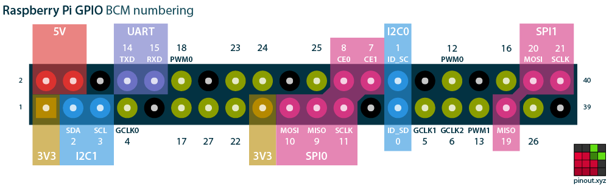

## 设备与目标

- 主板：Raspberry Pi 3 Model B Plus Rev 1.4
- 系统：Raspberry Pi OS 12
- 传感器：常见 LM393 光敏电阻模块（`VCC/GND/DO/AO`）
- 目标：读取 `DO`，并从 GPIO 输出 3.3V 数字信号

树莓派 GPIO 的高电平是 3.3V，不是 5V TTL。外部设备若只接受 5V 输入，必须增加电平转换器。

## 接线

| 光敏模块 | 树莓派         | 物理针脚 |
| -------- | -------------- | -------: |
| `VCC`    | 3.3V           |        1 |
| `GND`    | GND            |        6 |
| `DO`     | GPIO17（输入） |       11 |
| `AO`     | 不接           |        — |

TTL 输出接到外部设备：

```text
树莓派 GPIO27（物理 Pin 13） ──→ 外部设备数字输入
树莓派 GND（物理 Pin 14）    ──→ 外部设备 GND
```

两台设备必须共地。GPIO27 输出约 0/3.3V，不能承受或输出 5V。

## 软件配置

树莓派已安装脚本：`/home/liulab/ldr_do.py`。运行：

```bash
python3 /home/liulab/ldr_do.py
```

脚本使用 GPIO 边沿事件，不做软件轮询和延时去抖，以降低响应延迟：

```python
from signal import pause
from gpiozero import Button, DigitalOutputDevice

sensor = Button(17, pull_up=True)       # DO 常见为低电平有效
ttl_out = DigitalOutputDevice(27, initial_value=False)

def triggered():
    print("DO active", flush=True)
    ttl_out.on()

def cleared():
    print("DO inactive", flush=True)
    ttl_out.off()

sensor.when_pressed = triggered
sensor.when_released = cleared
pause()
```

若模块明暗逻辑相反，将 `pull_up=True` 改为 `pull_up=False`。若输出抖动，先调节模块电位器；不要直接把 GPIO 接到 5V。

## 外壳与引脚图



- [Pi 3B+ 外壳 STL（GitHub）](https://github.com/jdcasey/rpi-case-models/blob/master/pi3Bplus-case.stl)
- [卡扣式 Pi 3B+ 外壳（Printables）](https://www.printables.com/model/24942-raspberry-pi-34-b-case)
- [LM393 四针光敏模块外壳搜索（Yeggi）](https://www.yeggi.com/q/lm393%2Bphotoresistor/)

树莓派外壳通常已有 USB、HDMI、网口、电源和 GPIO 开孔；光敏探头或 TTL 线的侧面出线孔通常需要自行加孔。
