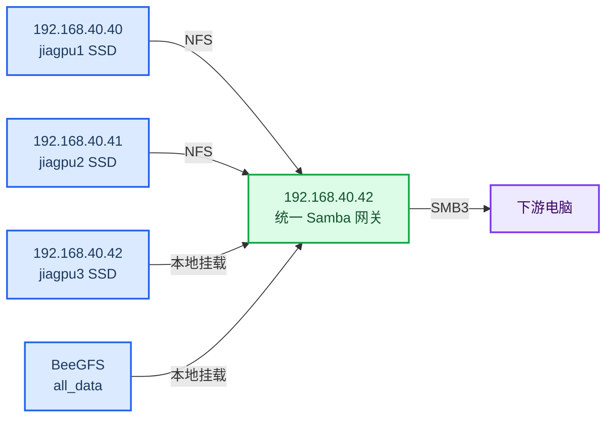

_实施日期：2026-08-19 · 网关节点：`192.168.40.42`（jiagpu3）· 状态：已上线并完成端到端验证_

---

## 📋 实施结果

`192.168.40.42` 现在是下游电脑的统一 SMB 入口：

- `.40` 和 `.41` 使用 NFS 向 `.42` 提供各自的 SSD 数据
- `.42` 将 `.40`、`.41`、`.42` 和 BeeGFS 数据统一发布为 SMB 共享
- NFS 挂载成功并通过检查后，Samba 才会启动
- 客户端继续使用现有 `micelab` 账户，密码未写入本文档

## 🏗️ 最终架构



设计原则：

- 服务器内部链路使用 NFS，`.40/.41` 的导出只授权 `.42` 挂载
- 用户只连接 `.42`，无需分别连接三台 GPU 节点
- 不再使用“`.42` 挂载 `.41` 的 SMB，再二次发布 SMB”的双层 SMB 结构

## 🗂️ SMB 共享映射

| SMB 共享 | 数据来源 | `.42` 上的路径 | 说明 |
| --- | --- | --- | --- |
| `all_data` | BeeGFS 公共数据 | `/beegfs_hdd/data/nfs_share/share/micelab/all_data` | 公共共享 |
| `ssd_data_gpu1` | `.40` 本机 SSD | `/srv/remote/jiagpu1/ssd_data` | 新增共享 |
| `ssd_data_gpu2` | `.41` 本机 SSD | `/srv/remote/jiagpu2/ssd_data` | 替代旧 CIFS 转发 |
| `ssd_data_gpu3` | `.42` 本机 SSD | `/nvmessd/docker/volumes/mice_data/_data` | 规范名称 |
| `ssd_data` | `.42` 本机 SSD | `/nvmessd/docker/volumes/mice_data/_data` | 保留旧客户端兼容性 |

新接入建议统一使用：

```text
\\192.168.40.42\ssd_data_gpu1
\\192.168.40.42\ssd_data_gpu2
\\192.168.40.42\ssd_data_gpu3
```

## 🔧 实施内容

### 192.168.40.40（jiagpu1）

- 启用宿主机 `nfs-server` 并设置开机启动
- 导出 `/nvmessd/docker/volumes/mice_data/_data`
- NFS 挂载授权限制为 `192.168.40.42`
- 使用 `all_squash,anonuid=1000,anongid=1000`，保持 `.40` 原有文件所有权

### 192.168.40.41（jiagpu2）

- 停止旧的故障 `nfs-server` 容器，并取消其自动重启；容器未删除
- 启用宿主机 `nfs-server` 并设置开机启动
- 导出 `/nvmessd/docker/volumes/mice_data/_data`
- 使用 `all_squash,anonuid=100,anongid=101`，与现有数据权限一致

### 192.168.40.42（jiagpu3）

- 新增持久化 NFS 挂载：
  - `/srv/remote/jiagpu1/ssd_data`
  - `/srv/remote/jiagpu2/ssd_data`
- 将 Samba 改为 Docker Compose 声明式配置
- 使用 `codex-samba-gateway.service` 管理 Samba 生命周期
- 增加真实文件系统检查，防止远端挂载失败时误发布空目录
- 关闭匿名访问
- 对 `.40/.41` 远程共享关闭 oplock，并启用严格锁定
- 保留现有 `micelab` 账号和客户端凭据

## ⚙️ 启动与恢复机制

启动顺序如下：

1. systemd 挂载 `.40`：`srv-remote-jiagpu1-ssd_data.mount`
2. systemd 挂载 `.41`：`srv-remote-jiagpu2-ssd_data.mount`
3. `/usr/local/sbin/codex-samba-mount-check` 验证 NFS、BeeGFS 和本机 XFS
4. `codex-samba-gateway.service` 执行 `docker compose up`
5. 容器健康检查验证 `smbd`、`testparm` 和所有数据路径

> ⚠️ **运维原则：** 不要把 `docker restart samba` 作为常规重启方式。应重启 systemd 网关服务，让挂载依赖同时生效。

正确重启方式：

```bash
systemctl restart codex-samba-gateway.service
```

## 💻 使用说明

### Windows

在文件资源管理器地址栏输入：

```text
\\192.168.40.42\ssd_data_gpu1
```

按提示使用现有 `micelab` 账户认证。需要长期使用时，可通过“映射网络驱动器”分配盘符。

### macOS

在“访达 → 前往 → 连接服务器”中输入：

```text
smb://192.168.40.42/ssd_data_gpu1
```

### Linux

```bash
sudo mkdir -p /mnt/jiagpu-gpu1
sudo mount -t cifs //192.168.40.42/ssd_data_gpu1 /mnt/jiagpu-gpu1 \
  -o username=micelab,vers=3.0
```

命令会交互式询问密码。自动挂载时应使用权限为 `0600` 的凭据文件，不要把密码直接写入 `/etc/fstab`。

## 🩺 常用运维检查

在 `.42` 执行：

```bash
# 检查网关与挂载状态
systemctl is-active codex-samba-gateway.service
systemctl is-active srv-remote-jiagpu1-ssd_data.mount
systemctl is-active srv-remote-jiagpu2-ssd_data.mount

# 检查 Samba 容器
docker inspect samba --format '{{.State.Status}} {{.State.Health.Status}}'
docker exec samba smbstatus --shares

# 检查实际挂载来源
findmnt -T /srv/remote/jiagpu1/ssd_data
findmnt -T /srv/remote/jiagpu2/ssd_data

# 查看网关日志
journalctl -u codex-samba-gateway.service -n 100 --no-pager
```

正常状态应为：

```text
codex-samba-gateway.service               active
srv-remote-jiagpu1-ssd_data.mount         active
srv-remote-jiagpu2-ssd_data.mount         active
samba                                     running healthy
```

## ✅ 验证结果

- 五个共享均通过 SMB 创建、回读和删除测试
- `.40` 文件以 `1000:1000`、模式 `0664` 落盘
- `.41/.42` 文件以 `100:101`、模式 `0664` 落盘
- 匿名 SMB 访问已验证为拒绝
- 停止 Samba 和两个 NFS 挂载后，仅启动网关服务即可自动恢复正确顺序
- 模拟恢复测试中，Samba 约 40 秒达到 `healthy`

## ↩️ 回滚说明

旧配置仍保留：

| 项目 | 位置或名称 |
| --- | --- |
| 旧 Samba 容器 | `samba-pre-storage-migration-20260819` |
| 回滚脚本 | `/root/codex-storage-migration-20260819/rollback-to-pre-migration-samba` |
| 三台主机配置备份 | `/root/codex-storage-migration-20260819` |

在 `.42` 执行回滚：

```bash
/root/codex-storage-migration-20260819/rollback-to-pre-migration-samba
```

回滚会恢复原 `.42` Samba 容器；新增的 `.40` 共享不会继续由旧容器发布。

## ⚠️ 当前风险与后续工作

- `.42` 本机 SSD 已使用约 `98%`，剩余约 `828 GB`，应尽快设置容量告警和清理计划
- `.42 → .41` 的旧 CIFS 挂载 `/mnt/jiagpu2/ssd_data` 暂时保留用于观察期，但新架构已不再使用
- 稳定运行后可删除旧 CIFS 挂载和旧 Samba 容器；删除前应再次确认无客户端依赖
- Samba 密码暂未轮换，以免现有客户端中断；建议安排维护窗口后统一轮换

---

_本文档不包含任何明文密码。_
